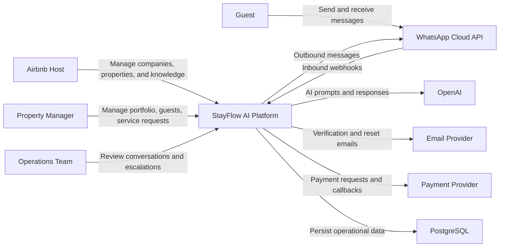
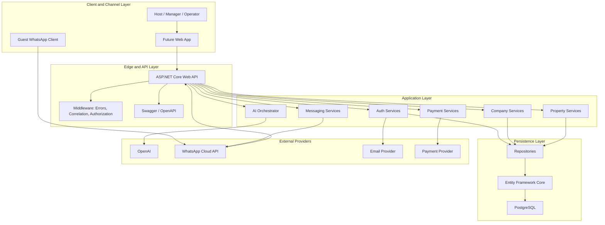
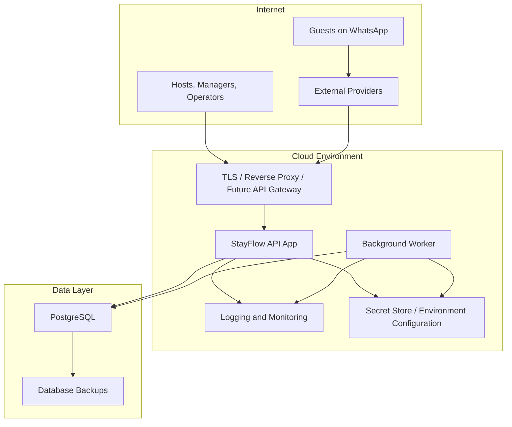
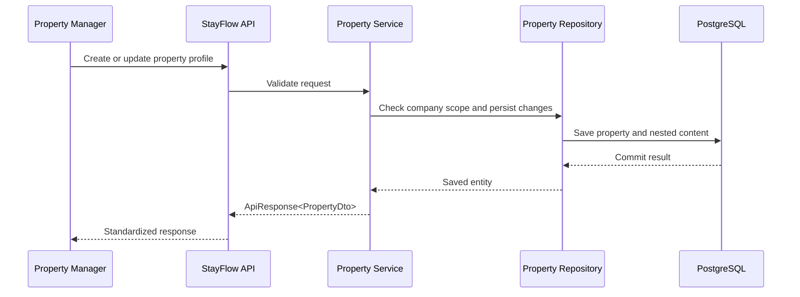
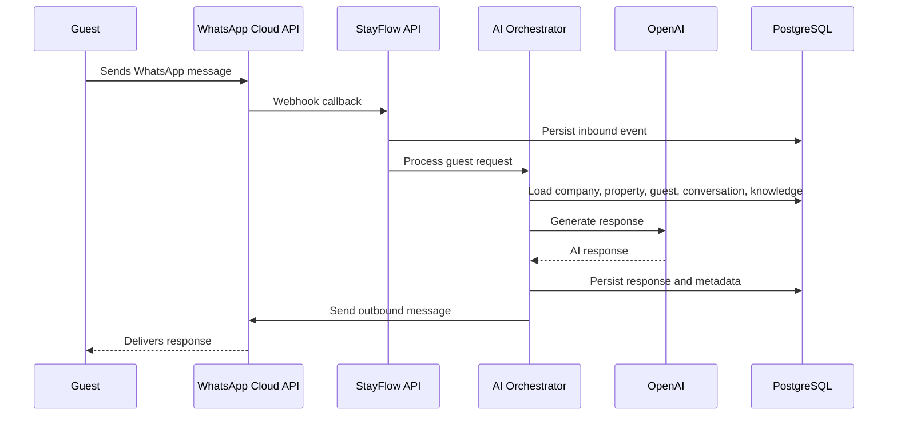

# 01 System Overview

## Purpose

This document describes the high-level architecture of StayFlow AI, an AI-powered WhatsApp concierge platform for Airbnb hosts and property managers in Kenya. It explains the platform context, major components, deployment shape, and technology stack.

## Platform Context

StayFlow AI helps hosts and property managers manage guest communication, property knowledge, service requests, and operational workflows. The platform combines structured property data, WhatsApp messaging, and AI-assisted responses so guests can receive fast, accurate support through a familiar channel.

## Core Capabilities

- Company and user management.
- Authentication, authorization, roles, permissions, and account security.
- Property profiles, amenities, house rules, recommendations, emergency contacts, and knowledge articles.
- Guest profiles and conversation history.
- WhatsApp-based guest communication.
- AI-assisted concierge responses grounded in property knowledge.
- Service provider marketplace and service request workflows.
- Payment records and future payment provider integrations.
- Audit logging, monitoring, documentation, and operational readiness.

## System Context Diagram

## Primary Components

### Backend API

The backend API is the central application service. It exposes REST APIs for company management, authentication, property management, and future guest, conversation, marketplace, payment, and analytics workflows.

Responsibilities:

- Request validation and standardized API responses.
- Authentication and authorization enforcement.
- Business workflow orchestration through service classes.
- Persistence through repository abstractions and Entity Framework Core.
- Global error handling, correlation IDs, health checks, and Swagger/OpenAPI.

### PostgreSQL Database

PostgreSQL is the system of record for StayFlow AI.

It stores:

- Companies, users, roles, and permissions.
- Properties and nested property content.
- Guests, conversations, service requests, providers, and payments.
- Authentication support tables such as refresh tokens and reset tokens.
- Audit logs and operational metadata.

Database design is company-scoped by default and optimized around common identifiers such as `CompanyId`, `PropertyId`, `GuestId`, `PhoneNumber`, and `CreatedAt`.

### WhatsApp Integration

WhatsApp Cloud API is the primary guest messaging channel.

Responsibilities:

- Receive guest messages through webhooks.
- Send AI-assisted or human-approved responses.
- Process delivery and message status callbacks.
- Support guest communication without requiring a separate mobile app.

### AI Orchestrator

The AI orchestrator is the application layer that prepares context, invokes OpenAI, and coordinates response workflows.

Responsibilities:

- Retrieve company, property, guest, and conversation context.
- Load approved property knowledge articles.
- Construct safe prompts with minimal necessary data.
- Call the AI provider through an integration boundary.
- Validate, persist, and route generated responses.
- Escalate uncertain or high-risk requests to human operators.

### Background Services

Background services will handle work that should not block HTTP requests.

Candidate workloads:

- WhatsApp webhook processing.
- AI response generation.
- Message delivery retries.
- Email delivery.
- Scheduled reminders.
- Cleanup of expired tokens and stale operational data.
- Analytics pre-aggregation.

### Documentation and Operations

The `/docs` folder captures architecture, API, database, security, product, business, testing, UI/UX, sprint, ADR, and developer documentation. Documentation should evolve alongside implementation.

## Component Diagram

## Deployment Overview

StayFlow AI should be deployed as a secure, environment-specific SaaS application. The initial deployment can be simple, but it should preserve clean boundaries for growth.

## Environment Model

- **Local**: Developer environment with local configuration, local or containerized PostgreSQL, Swagger, and test data.
- **Staging**: Production-like environment for validating deployments, migrations, integrations, and operational procedures.
- **Production**: Customer-facing environment with managed configuration, backups, monitoring, secure secrets, and controlled releases.

## Technology Stack

| Area | Technology | Notes |
| --- | --- | --- |
| Backend API | ASP.NET Core Web API | Main application runtime and HTTP API surface. |
| Language | C# / .NET | Strong typing, mature backend tooling, and async-first patterns. |
| Database | PostgreSQL | Primary relational database and system of record. |
| ORM | Entity Framework Core | Migrations, Fluent API configuration, and repository-backed data access. |
| API Docs | Swagger / OpenAPI | Development-time API exploration and contract visibility. |
| Authentication | JWT and refresh tokens | Access tokens, refresh token rotation, password reset, and email verification groundwork. |
| Messaging | WhatsApp Cloud API | Guest communication channel. |
| AI Provider | OpenAI | AI-assisted concierge responses and future orchestration workflows. |
| Testing | xUnit | Backend unit tests and future integration tests. |
| Documentation | Markdown | Project documentation under `/docs`. |
| Source Control | Git and GitHub | Version control, pull requests, review, and CI workflows. |

## Key Data Flows

### Property Setup Flow

### Guest Message Flow

## Architectural Principles

- Keep company data isolated by default.
- Keep controllers thin and business logic in services.
- Keep persistence behavior in repositories and EF Core configurations.
- Prefer explicit boundaries for external integrations.
- Use asynchronous methods for I/O-bound work.
- Return standardized `ApiResponse<T>` objects from APIs.
- Preserve observability through structured logging, health checks, and correlation IDs.
- Document major decisions through ADRs.

## Current State

The backend foundation currently includes:

- ASP.NET Core Web API backend.
- PostgreSQL and Entity Framework Core.
- Swagger/OpenAPI.
- Health checks.
- Global error handling and correlation IDs.
- Standardized API responses.
- Company management APIs.
- JWT authentication groundwork.
- Role and permission groundwork.
- Property domain APIs and EF model.
- Unit tests for core service behavior.
- Documentation foundation across architecture, API, database, security, product, business, testing, UI/UX, sprints, and developer practices.

## Future Evolution

Future architecture work should expand:

- Guest and conversation modules.
- WhatsApp webhook processing.
- AI orchestrator implementation.
- Background worker infrastructure.
- Payment provider integration.
- Analytics and reporting models.
- Monitoring dashboards and alerting.
- Disaster recovery procedures.
