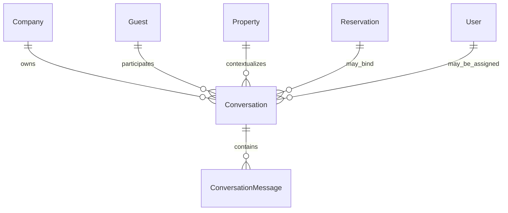
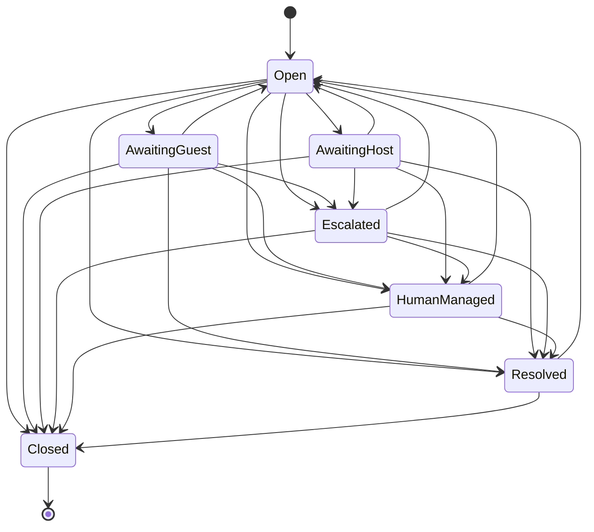

# StayFlow Conversation Engine

## Purpose

The Conversation Engine stores tenant-scoped guest, AI, host, and system messages for StayFlow AI. It provides the internal staff API for managing guest conversations before public Web or WhatsApp chat endpoints are introduced.

## Domain Model

Conversations track channel, channel identity, status, subject, optional assignment, human takeover state, escalation reason, start time, last activity, close time, and soft-delete fields.

Conversation messages track sender type, message type, content, external message ID, safe provider metadata, AI outcome, failure category, visibility, sent time, and audit timestamps.

## State Diagram

## Multi-Tenant Rules

- Every repository lookup includes `CompanyId`.
- Guest, reservation, property, and assigned user associations must belong to the authenticated company.
- Reservation binding is accepted only when the reservation belongs to the conversation guest.
- Cross-tenant conversation and message access returns a safe not-found response.

## Message Visibility

Guest-visible history excludes internal notes and host-only operational details. Internal notes use `IsInternal = true` and `MessageType = InternalNote`.

## Human Takeover

When a conversation enters `HumanManaged`, AI messages are blocked by the centralized transition policy. Staff can return the conversation to AI mode with the `return-to-ai` endpoint.

## AI Integration

The internal conversation AI exchange service stores the guest message, invokes the existing AI orchestrator, stores the safe AI response or escalation event, and updates conversation activity. It does not expose a public chat API in Sprint 1.

## External Idempotency

External channel deliveries can supply `ExternalMessageId`. The database enforces uniqueness for `(CompanyId, ExternalMessageId)` when the external ID is present, preventing duplicate webhook delivery from creating duplicate messages.

## Internal API Endpoints

- `POST /conversations`
- `GET /conversations/{conversationId}`
- `GET /conversations/{conversationId}/messages`
- `POST /conversations/{conversationId}/messages/host`
- `POST /conversations/{conversationId}/notes`
- `POST /conversations/{conversationId}/escalate`
- `POST /conversations/{conversationId}/human-takeover`
- `POST /conversations/{conversationId}/return-to-ai`
- `POST /conversations/{conversationId}/resolve`
- `POST /conversations/{conversationId}/close`

## Future Integrations

Sprint 2 can add guest-facing Web and WhatsApp entry points that call the conversation application services without bypassing tenant validation, identity checks, state transitions, or idempotency rules.
