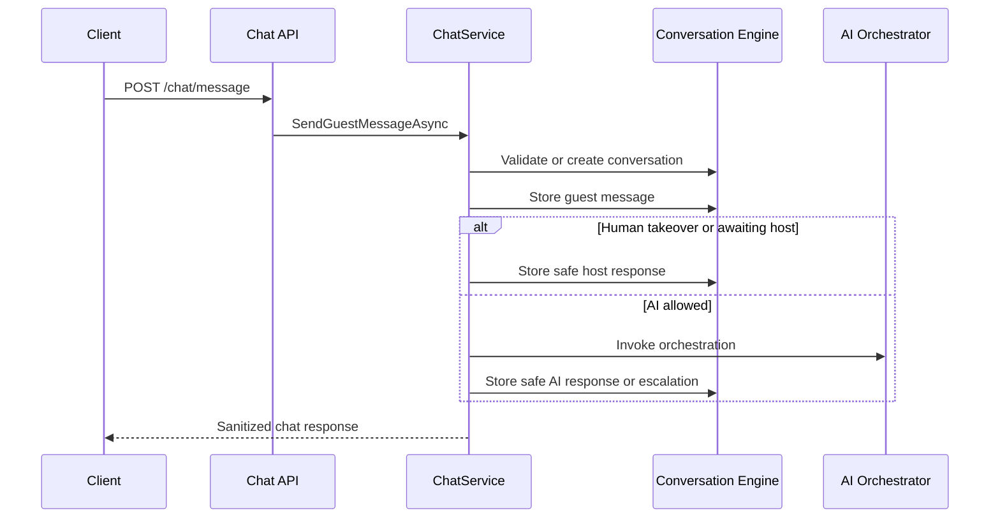

# Guest Chat API

## Purpose

The Guest Chat API is the guest-facing application layer for frontend chat and future WhatsApp integrations. Sprint 2 keeps these endpoints authenticated; anonymous guest access is not enabled yet.

## Request Flow

## Conversation Reuse

When no `ConversationId` is supplied, the service reuses an open compatible conversation when company, guest, channel, channel identity, and reuse window match. Closed conversations are not reused; a new guest message without `ConversationId` creates a new conversation.

## State Handling

- `Open`: AI may respond.
- `AwaitingGuest`: AI may respond when the guest sends a new message.
- `AwaitingHost`, `Escalated`, `HumanManaged`: AI is not invoked automatically.
- `Resolved`: follows the conversation engine reopen policy.
- `Closed`: rejects messages sent to that conversation ID.

## Human Takeover

Human takeover stores guest messages and returns a safe host-response message without invoking the AI provider. Staff can return the conversation to AI mode through the internal `/conversations` API.

## Idempotency

`ExternalMessageId` prevents duplicate channel delivery from storing duplicate guest messages or invoking AI twice. The database-level uniqueness protection from the conversation engine remains the final guard.

## Tenant Security

Every request is scoped by the authenticated tenant context. `GuestId` is validated against the tenant, and supplied conversation IDs must belong to the tenant and match guest/channel context.

## AI Exchange Persistence

Only guest-safe responses and safe provider metadata are persisted. API keys, JWTs, raw prompts, raw exceptions, and sensitive diagnostics are not stored in conversation messages.

## Future Guest Token Design

Future anonymous guest access should use a short-lived guest token containing company, guest, reservation, channel, and expiration claims. Until that exists, the API requires authenticated JWT access.

## Future Real-Time Path

Typing indicators and real-time message delivery can be added later through SignalR or WebSockets without changing the persistence model.

## WhatsApp Integration

WhatsApp webhooks should call the Chat API/application service with `Channel = WhatsApp`, a normalized phone channel identity, and an external message ID for idempotency.
