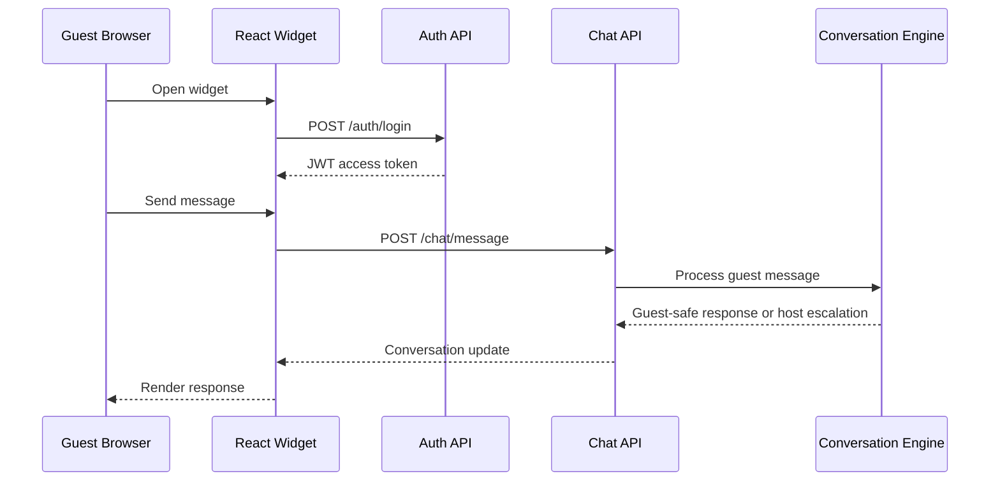
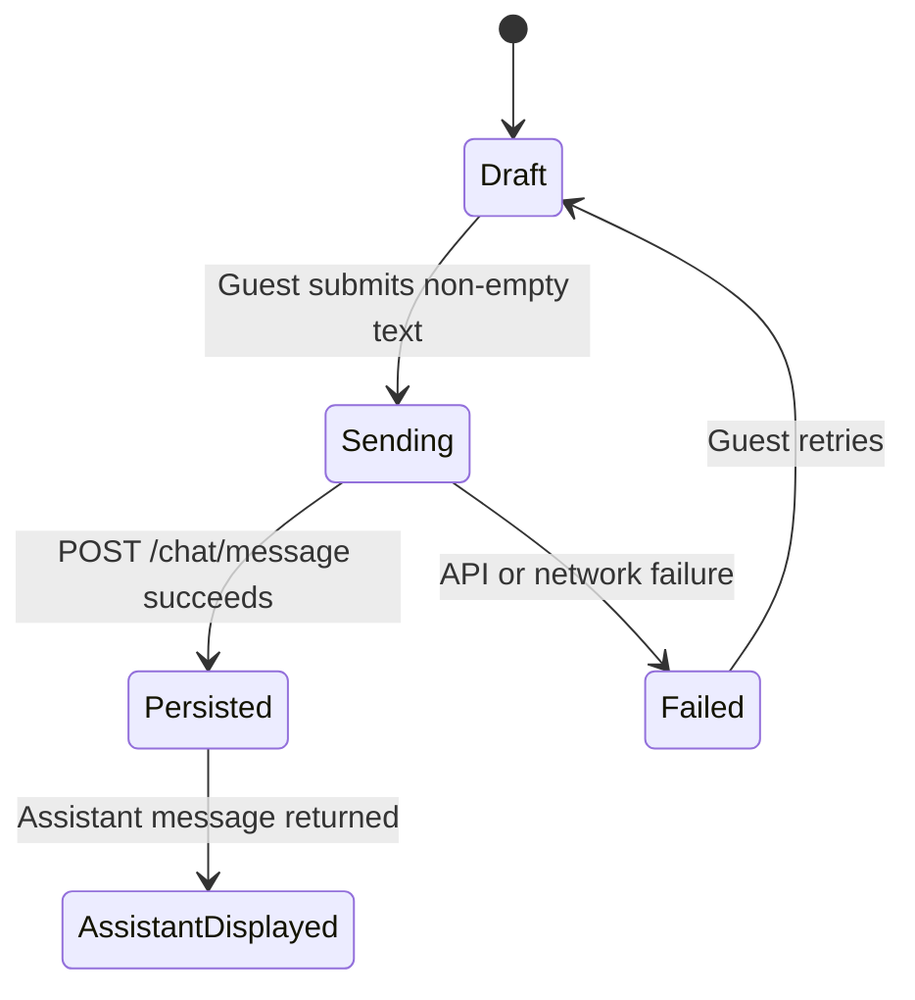

# Guest Chat Widget Architecture

## Context

The guest chat widget is the browser entry point for StayFlow AI conversations. It uses the authenticated chat API from the backend and is designed to evolve into an embeddable property-manager experience in later sprints.

## Design Principles

- Keep tenant isolation on the backend.
- Treat browser-provided guest and reservation hints as untrusted until validated by backend services.
- Avoid anonymous public access until a dedicated guest-token design is approved.
- Keep styling scoped with `sf-chat-` class names and CSS variables.
- Preserve drafts on failed sends so guests do not lose typed messages.

## Deployment Overview

For local development, Vite serves the frontend on port `5173` and the ASP.NET Core API serves HTTP on port `5243`. Development CORS permits only configured local frontend origins.

Production hosting is intentionally not finalized in Sprint 3. Future deployment decisions should document whether the widget is served from the StayFlow SaaS app, a CDN-backed bundle, or customer-specific embeds.

## Authentication Approach

Sprint 3 uses the existing authenticated backend flow for staff/demo testing. The widget calls `POST /auth/login`, keeps the access token in memory, and stores the access token in `sessionStorage` only to make local refresh testing practical.

The widget does not store refresh tokens, passwords, API keys, OpenAI keys, provider metadata, tenant identifiers, or diagnostics. Public guest token support is deferred to a later security design.

## API Integration

The API client wraps `fetch` with:

- JSON request headers.
- Bearer token injection.
- `AbortController` request timeouts.
- Typed `ApiResponse<T>` handling.
- Safe guest-facing error messages.

The widget sends `GuestChannel.Web` using the numeric enum value expected by the backend.

## State Management

The `useChat` hook owns widget state:

- Open and closed panel state.
- Authentication status.
- Active conversation ID.
- Message list.
- Conversation status.
- Host-attention flags.
- Loading and sending states.
- Error state.
- Unread count.

Only safe local state is persisted: the active conversation ID, open preference, and the development access token.

## Message Lifecycle

The composer trims empty messages, prevents duplicate sends while a request is in flight, includes an external message ID for idempotency, and preserves failed drafts.

## Escalation Behavior

When the backend reports host attention or human takeover, the widget displays a guest-services banner and stops implying that the AI is actively responding. Guests may still send messages unless the backend closes the conversation.

## End-Conversation Behavior

Ending a conversation requires confirmation. After the backend closes the conversation, the widget disables the composer, preserves the closed conversation history, and offers a start-new action that clears only the active conversation state.

## Accessibility

The widget uses semantic buttons, labelled inputs, polite live regions for messages, keyboard-friendly controls, Escape-to-close behavior, and visible disabled states. Future work should add a stricter focus trap when the widget becomes a production embed.

## Future SignalR Support

SignalR is intentionally out of scope for Sprint 3. Future realtime support should subscribe to conversation updates after authentication and continue to route all tenant and guest authorization through the backend.

## Future Guest-Token Support

A public guest-token flow should replace the development login before customer embedding. That design must define token issuance, expiry, revocation, guest binding, reservation binding, and cross-tenant protections.

## Embed Strategy

The current code exports `StayFlowChatWidget` as a React component. Future packaging options include:

- A React package.
- A standalone JavaScript bundle.
- An iframe embed.
- A customer-specific hosted widget script.

## Technology Stack

- React
- TypeScript
- Vite
- Vitest
- React Testing Library
- ASP.NET Core chat API
