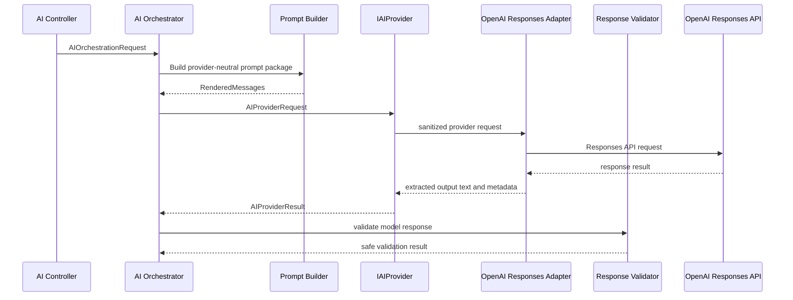

# OpenAI Provider

## Purpose

StayFlow AI supports a production OpenAI provider behind the existing `IAIProvider` abstraction. The orchestrator, prompt builder, response validator, and API controllers remain provider-neutral.

## Provider Selection

Provider selection is controlled by configuration:

```json
{
  "AIProvider": {
    "Provider": "OpenAI"
  },
  "OpenAI": {
    "Model": "gpt-5.1-mini",
    "TimeoutSeconds": 30,
    "MaxOutputTokens": 800
  }
}
```

Supported values:

- `Development`: deterministic local provider for development and tests.
- `OpenAI`: production provider using the official OpenAI .NET SDK.

Unsupported provider names fail startup validation.

## SDK Package

The backend uses the official `OpenAI` NuGet package, version `2.12.0`. The implementation uses `OpenAI.Responses.ResponsesClient` and the Responses API through a narrow `IOpenAIResponsesClient` adapter.

The SDK marks the Responses types with `OPENAI001`, so the suppression is scoped only to `OpenAIResponsesClient`. Application services must not depend directly on SDK-specific types.

## Secret Handling

The API key must never be committed. Configure it through environment variables, user secrets, or a deployment secret store:

```powershell
$env:OpenAI__ApiKey = "..."
```

For local development:

```bash
dotnet user-secrets set "OpenAI:ApiKey" "<secret>" --project backend/backend.csproj
```

The API key is required only when `AIProvider:Provider` is set to `OpenAI`. The `Development` provider does not require OpenAI credentials.

## Request Flow



## Prompt Boundary

`OpenAIAIProvider` sends only `AIPromptPackage.RenderedMessages` to the provider adapter. It does not add tenant identifiers, database identifiers, API keys, raw internal notes, or unapproved context.

Rendered message order and role intent are preserved:

- `system`
- `developer`
- `assistant`
- `user`

Unknown roles are normalized to `user`.

## Response Handling

The provider accepts a response only when output text is present and the response is not marked incomplete or refused. Empty, incomplete, unexpected, failed, or unavailable responses are converted to provider-neutral failure categories.

Failure categories:

- `Timeout`
- `RateLimited`
- `Authentication`
- `InvalidRequest`
- `ProviderServerError`
- `Network`
- `Cancelled`
- `EmptyResponse`
- `UnexpectedResponse`
- `Unknown`

The application response validator remains authoritative for guest-facing safety, protected identifier disclosure, response length, access-control leakage, and escalation decisions.

## Retry Policy

StayFlow does not implement application-level OpenAI retries in the provider. The SDK transport may apply its own safe defaults. Any future retry policy must be bounded, observable, and must not replay requests after caller cancellation.

## Logging Restrictions

Provider logs may include:

- Provider name.
- Model name.
- Correlation ID.
- Duration.
- Failure category.

Provider logs must not include:

- API keys.
- Full prompts.
- Guest messages.
- Full model responses.
- Protected internal identifiers.
- Secrets, credentials, or internal notes.

## Related Documentation

- [OpenAI Integration](06-openai-integration.md)
- [AI Orchestrator](04-ai-orchestrator.md)
- [Security Architecture](07-security-architecture.md)
- [Secret Management](../security/Secret%20Management.md)
