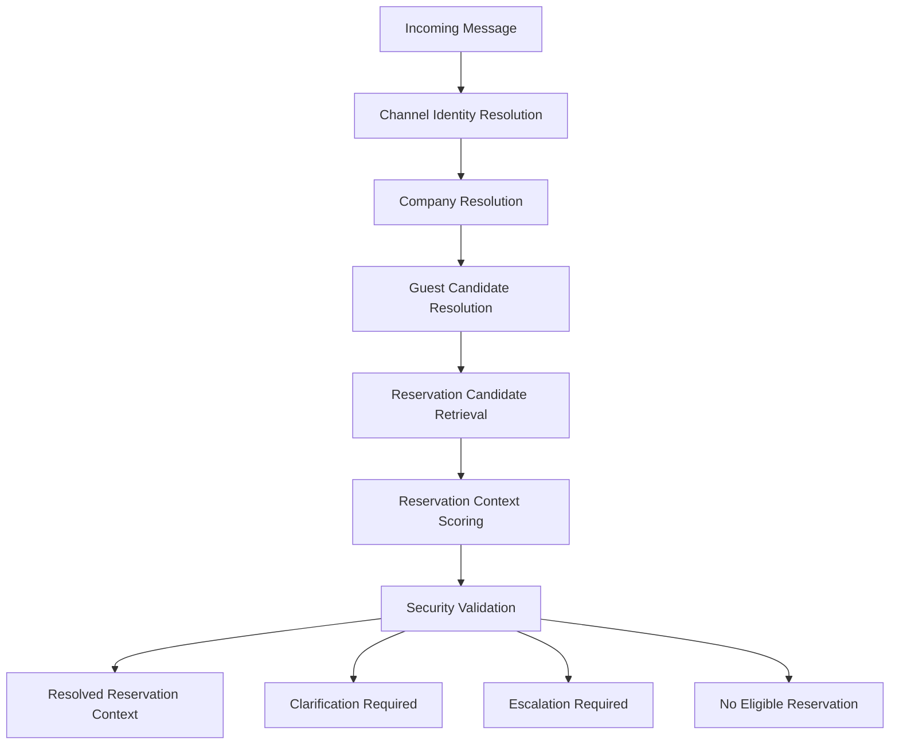

# ADR-0007: Reservation Context Resolution

## Status

Accepted

## Context

StayFlow AI receives guest communication primarily through channels such as WhatsApp. A phone number or WhatsApp identifier may be associated with:

- One active reservation.
- Multiple active reservations.
- Multiple upcoming reservations.
- An active reservation and an upcoming reservation.
- Historical reservations only.
- No reservation.
- Reservations at different properties.
- Reservations within the same company.
- Potentially conflicting guest identity matches.

StayFlow AI must determine the correct reservation context before building AI context, retrieving property knowledge, sending check-in instructions, sending property access information, processing service requests, processing checkout workflows, or personalizing guest responses.

Incorrect reservation selection may expose property information or sensitive access instructions to the wrong guest.

## Decision

Implement a Reservation Context Resolver as a dedicated application service. The resolver is conceptually named `IReservationContextResolver` and exposes a conceptual operation:

```csharp
ResolveAsync(ReservationContextRequest request)
```

This ADR does not implement the interface or application code.

The conceptual resolution flow is:



Possible resolver outcomes are:

- `Resolved`.
- `ClarificationRequired`.
- `EscalationRequired`.
- `NoEligibleReservation`.

## Resolution Rules

### Rule 1: Tenant Scope

Company context must be established before reservation candidate retrieval. Never search reservations across companies for AI context resolution.

### Rule 2: Deterministic Conversation Context

If the current verified conversation is already bound to a valid reservation and the reservation remains relevant to the conversation, use that reservation after revalidating tenant and guest association.

### Rule 3: Single Active Reservation

If exactly one eligible active reservation exists for the verified guest within the company, select it.

### Rule 4: Single Relevant Upcoming Reservation

If no active reservation exists and exactly one eligible upcoming reservation exists within the configured pre-arrival window, select it. The pre-arrival window must be configurable.

### Rule 5: Explicit Reservation Reference

If the guest provides a valid confirmation number or source-aware reservation reference, use it only after validating company, guest association, and reservation eligibility. Do not reveal whether unrelated reservation references exist.

### Rule 6: Multiple Candidate Reservations

If multiple eligible reservations remain, do not guess. The system must request clarification using non-sensitive property labels.

Example:

```text
I found more than one current or upcoming stay. Which stay are you asking about?
```

Safe clarification labels may include:

- Property display name.
- City.
- Check-in date.

Clarification must not present:

- Door codes.
- Full addresses when restricted.
- Internal reservation IDs.
- Other guest names.
- Internal notes.

### Rule 7: No Reservation

If no eligible reservation is found:

- Allow general non-sensitive hospitality assistance where policy permits.
- Do not provide reservation-specific information.
- Do not provide access instructions.
- Do not provide property secrets.
- Offer reservation verification or host escalation.

### Rule 8: Conflicting Guest Identity

If phone, WhatsApp identifier, or email resolution produces conflicting guest identities:

- Block reservation-specific AI context.
- Do not automatically merge guest profiles.
- Escalate or initiate approved identity verification.

### Rule 9: Sensitive Access Information

Sensitive property access information requires:

- Resolved company.
- Resolved guest.
- Resolved reservation.
- Eligible reservation lifecycle state.
- Verified conversation or channel context.
- Property access release rules satisfied.

The AI model must not independently decide whether access information may be released. Access authorization must be determined by deterministic application logic before AI context construction.

### Rule 10: Context Persistence

Once a reservation is explicitly selected or safely resolved, the conversation may be temporarily bound to that reservation.

The binding must record:

- Binding timestamp.
- Resolution method.
- Reservation ID.
- Guest ID.
- Company ID.
- Expiration or invalidation conditions.

The binding must be invalidated when:

- Reservation becomes cancelled.
- Tenant context changes.
- Guest identity becomes disputed.
- Conversation explicitly changes reservation.
- Security validation fails.

Do not create unrestricted permanent reservation bindings.

## Reservation Context Scoring

The resolver may use deterministic candidate scoring to rank reservation candidates. Potential signals include:

- Existing verified conversation binding.
- Active Stay status.
- Checked In status.
- Pre-Arrival eligibility.
- Check-in and check-out date proximity.
- Explicit reservation reference.
- Property explicitly named by the guest.

Scoring may rank candidates, but scoring must not override ambiguity rules. A high score alone must not authorize sensitive access information.

## Security Requirements

- Reservation resolution must occur before AI context construction.
- The AI model must never receive multiple reservations and be asked to guess the correct reservation for sensitive workflows.
- The AI model must never determine access authorization.
- All tenant validation must occur before reservation data retrieval.
- All sensitive access release decisions must be deterministic and auditable.

## Audit Requirements

Record:

- Correlation ID.
- Company ID.
- Guest candidate ID where known.
- Candidate reservation count.
- Resolution outcome.
- Resolution method.
- Selected reservation ID when resolved.
- Clarification requested.
- Escalation reason.
- Security validation result.

Do not log sensitive access secrets.

## Consequences

- Reservation context selection becomes deterministic, auditable, and separate from AI prompt construction.
- The AI Context Builder can assume reservation context has already been resolved or explicitly marked as ambiguous.
- WhatsApp workflows must route inbound messages through identity and reservation context resolution before stay-specific AI responses.
- Sensitive access workflows gain a deterministic authorization boundary before AI.
- Product documentation must describe clarification behavior for ambiguous reservations.

## Alternatives Considered

- Let the AI model choose the reservation: rejected because it risks leaking property, guest, and access information and cannot satisfy deterministic audit requirements.
- Use the most recent reservation automatically: rejected because recency does not resolve multiple active or upcoming reservations safely.
- Bind every conversation permanently to the first matched reservation: rejected because reservations can become cancelled, guest identity can be disputed, and conversations can change subject.
- Require manual host selection for every message: safe but too slow for normal concierge workflows.
