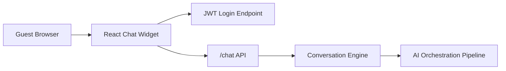

# Guest Chat Widget Development

## Executive Summary

The StayFlow guest chat widget is a React and TypeScript frontend for the authenticated guest conversation API. Sprint 3 provides a polished local-development widget that can open a protected conversation, send guest messages, load conversation history, request host escalation, and end a conversation.

This sprint intentionally does not implement anonymous public guest access, SignalR, host dashboard functionality, WhatsApp UI, or guest token issuance.

## Architecture



## Main Components

- `StayFlowChatWidget` owns widget configuration, theme variables, and launcher placement.
- `useChat` owns authenticated chat state, API calls, optimistic sending, host escalation, and end-conversation behavior.
- `ChatPanel` composes authenticated chat UI, local demo sign-in, lifecycle banners, and conversation actions.
- `ChatMessageList` renders guest-visible messages and keeps the newest messages in view.
- `ChatComposer` supports Enter-to-send and Shift+Enter for new lines.

## API Dependencies

The widget calls the protected Sprint 2 chat API:

- `POST /auth/login`
- `POST /chat/message`
- `GET /chat/{conversationId}/history`
- `POST /chat/{conversationId}/escalate`
- `POST /chat/{conversationId}/end`

The browser does not send tenant identifiers. Tenant isolation remains enforced by the backend JWT and current tenant context.

## Local Development

1. Start the backend and database with Docker Compose or run the API locally.
2. Start the frontend from `frontend`.
3. Open the Vite URL, usually `http://localhost:5173`.
4. Use a seeded development account and the demo guest ID from `.env.example`.

```bash
cd frontend
npm install
npm run dev
```

Backend startup:

```bash
dotnet run --project backend/backend.csproj --urls http://localhost:5243
```

Docker Compose startup:

```bash
docker compose up postgres api frontend
```

## Environment Variables

- `VITE_STAYFLOW_API_URL` sets the backend base URL.
- `VITE_DEMO_EMAIL` optionally pre-fills the local login email.
- `VITE_DEMO_GUEST_ID` sets the demo guest used by the widget.
- `VITE_DEMO_RESERVATION_ID` optionally binds the demo request to a reservation.
- `VITE_DEMO_PROPERTY_ID` optionally binds the demo request to a property.

Never commit demo passwords, JWTs, refresh tokens, or provider secrets.

## Manual Smoke Test

1. Start PostgreSQL, the backend API, and the frontend.
2. Open `http://localhost:5173`.
3. Open the StayFlow widget.
4. Sign in with a development account.
5. Send `What are my check-in and check-out dates?`.
6. Confirm the guest message and assistant response render.
7. Refresh the browser and confirm history reloads.
8. Use the host escalation action and confirm the host-attention banner appears.
9. Send another guest message and confirm no misleading AI typing state appears during host handoff.
10. End the conversation and confirm the composer is disabled.
11. Start a new conversation and confirm a future message can create a fresh conversation.

## Troubleshooting CORS

- Confirm the frontend is running on `http://localhost:5173` or `http://127.0.0.1:5173`.
- Confirm `backend/appsettings.Development.json` contains the Vite origin.
- Confirm `ASPNETCORE_ENVIRONMENT=Development`.
- Do not use wildcard production CORS to fix local issues.

## Troubleshooting API Connectivity

- Confirm the backend is listening on the URL configured by `VITE_STAYFLOW_API_URL`.
- Confirm the development seed service completed successfully.
- Confirm the browser request includes an `Authorization` header after login.
- If the chat request returns `401`, sign in again.
- If the chat request returns `404`, clear the active conversation from session storage and start a new conversation.

## Content Security Policy Guidance

Production hosting should use a restrictive Content Security Policy. At minimum, allow API connections only to approved StayFlow API origins and image sources only where the selected logo or property imagery is hosted.

## Security Considerations

- The widget requires authentication for Sprint 3.
- Access tokens are kept in browser session storage for local demo continuity only.
- Refresh tokens are not stored by the widget.
- API errors are normalized so raw server details and tokens are not displayed.
- Internal tenant identifiers are not accepted from widget configuration.
- CORS is enabled only for configured development origins.

## Accessibility

- The launcher exposes expanded state.
- The message region uses polite live updates.
- Composer controls are labeled.
- The end-conversation confirmation uses a modal dialog role.
- Disabled states are visible for closed, escalated, or human-managed conversations.

## Testing

Frontend tests cover:

- Protected login and message sending.
- Blank-message prevention.
- Enter and Shift+Enter composer behavior.
- Host escalation state rendering.
- Message sorting, de-duplication, and internal-note filtering.
- API authorization header and normalized unauthorized response behavior.

Run:

```bash
cd frontend
npm run typecheck
npm run lint
npm run test
npm run build
```
