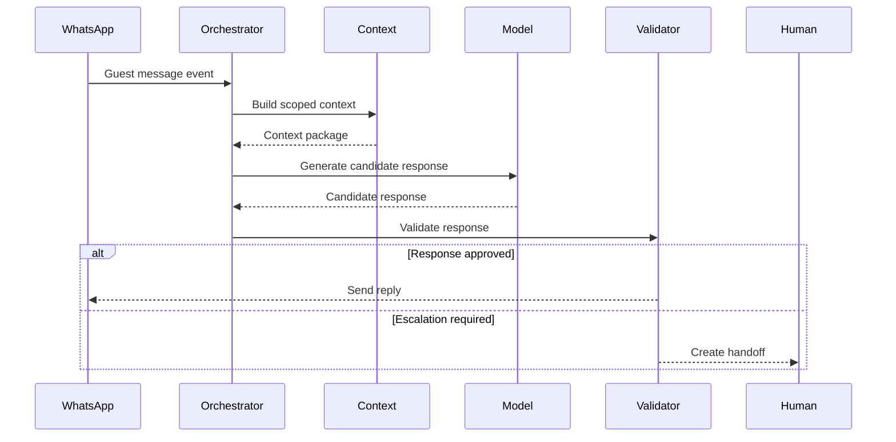

# AI Orchestrator

## Business Purpose

The AI Orchestrator coordinates the end-to-end decision flow for guest messages. It determines what data is needed, which AI capabilities should run, whether a response can be sent automatically, and when a human should take over.

## User Stories

- As a guest, I want one coherent response rather than fragmented system outputs.
- As a host, I want the orchestrator to decide when AI can answer safely.
- As an operations user, I want escalation decisions to be consistent and traceable.

## Functional Requirements

- Receive normalized conversation events from WhatsApp workflows.
- Classify intent, urgency, language, and confidence.
- Select context sources such as property, reservation, guest profile, memory, and knowledge articles.
- Route messages to response generation, task creation, or escalation.
- Record orchestration decisions and correlation identifiers.
- Support provider fallback and retry rules where appropriate.

## Non-Functional Requirements

- Orchestration must be deterministic for the same input and context where possible.
- The orchestrator must enforce tenant boundaries before calling AI providers.
- Decision traces must be available for audit and support review.
- The flow must handle provider timeout without blocking operational handoff.

## Validation Rules

- Company and conversation identifiers must be present before AI orchestration begins.
- Orchestrator must reject or escalate messages with missing critical context.
- High-risk intents must bypass direct AI reply unless explicitly approved by policy.
- Retry logic must not send duplicate guest replies.

## Edge Cases

- WhatsApp sends duplicate webhook events.
- Guest sends several messages before AI responds.
- Context builder returns conflicting data.
- AI provider times out after generating a response.
- Host manually responds while the orchestrator is processing.

## Acceptance Criteria

- Orchestrator responsibilities are clearly separated from prompt generation, retrieval, memory, validation, and escalation.
- AI decisions can be traced from guest message to final action.
- Human handoff is supported as a first-class outcome.

## Future Enhancements

- Policy-based orchestration rules per company.
- Multi-step tool use for service requests and reservations.
- Provider routing by language, cost, and confidence.
- Real-time orchestration dashboard.

