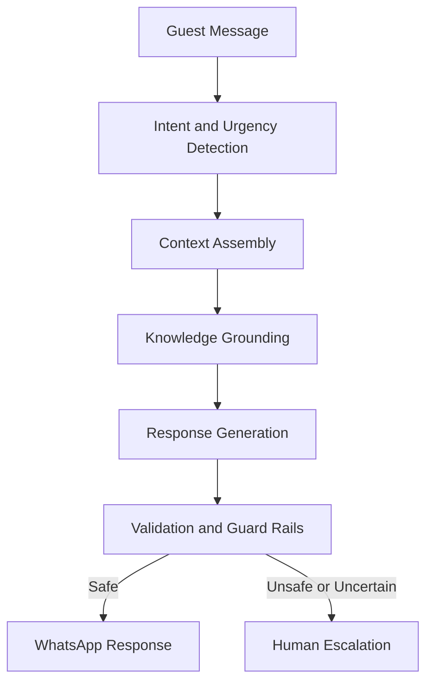

# AI Overview

## Business Purpose

The AI domain powers StayFlow AI's WhatsApp concierge experience. It helps hosts and property managers respond quickly to guest questions about check-in, house rules, amenities, recommendations, emergencies, reservations, payments, and service requests while reducing manual support load.

## User Stories

- As a guest, I want fast, accurate answers through WhatsApp.
- As a host, I want AI to handle repetitive questions using my property knowledge.
- As a property manager, I want AI to escalate sensitive or uncertain situations.
- As an administrator, I want AI behavior to be auditable and governed by clear guard rails.

## Functional Requirements

- Interpret guest messages and identify intent, urgency, language, and required context.
- Retrieve relevant company, property, guest, reservation, and knowledge base data.
- Build prompts using approved templates and context minimization rules.
- Generate helpful responses grounded in available knowledge.
- Validate responses before delivery.
- Escalate issues that require human action, safety judgment, payment handling, or policy approval.

## Non-Functional Requirements

- AI responses should be low latency enough for conversational WhatsApp use.
- AI behavior must be explainable through logs, prompt metadata, and decision traces.
- AI context must be company isolated and privacy aware.
- The system must degrade gracefully when model providers are unavailable.

## Validation Rules

- AI must not answer from another company's data.
- AI must not fabricate access codes, prices, policies, availability, or payment status.
- AI must not expose sensitive personal data unless explicitly required and allowed.
- AI must escalate emergencies, legal threats, abuse, payment disputes, and uncertain access issues.

## Edge Cases

- Guest asks a question without an active reservation.
- Guest sends mixed-language or ambiguous messages.
- Guest asks for information about another property.
- Knowledge base content is outdated or conflicting.
- AI provider is unavailable or returns an unsafe response.

## Acceptance Criteria

- AI product documentation defines domain scope, product principles, and safety expectations.
- AI behavior is grounded in StayFlow company, property, guest, and reservation data.
- AI escalation and validation are treated as core product capabilities.

## Future Enhancements

- Multilingual response quality scoring.
- Host-configurable AI personality profiles.
- AI analytics for unanswered questions.
- Model provider abstraction and fallback routing.

