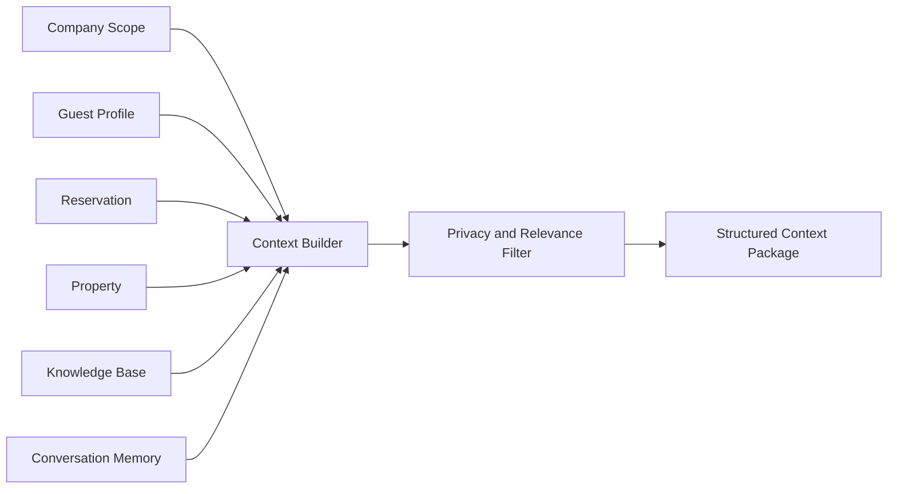

# Context Builder

## Business Purpose

The Context Builder assembles the minimum useful information needed for AI to answer a guest. It keeps responses grounded while reducing privacy, cost, and hallucination risk.

## User Stories

- As a guest, I want AI replies to reflect my current stay.
- As a host, I want AI to use the right property and reservation data.
- As an administrator, I want personal data minimized before it reaches an AI provider.

## Functional Requirements

- Build context from company, property, guest, reservation, conversation memory, knowledge articles, service requests, and policies.
- Apply relevance ranking and data minimization rules.
- Include source labels and freshness metadata.
- Detect missing, stale, or conflicting context.
- Provide structured context to the Prompt Builder.

## Non-Functional Requirements

- Context assembly must be fast enough for real-time WhatsApp replies.
- Context must be company isolated.
- Context packages should be concise and deterministic.
- Sensitive fields must be redacted or excluded according to privacy rules.

## Validation Rules

- Company scope must be validated before any context lookup.
- Property context must match the active reservation or selected conversation scope.
- Guest data must be minimized to service-relevant facts.
- Stale context must be flagged before prompt construction.

## Edge Cases

- Guest has multiple active reservations.
- Phone number matches more than one guest record.
- Property knowledge conflicts with house rules.
- Reservation context is missing after an imported booking.
- Guest asks about a property they are not staying at.

## Acceptance Criteria

- Context Builder documentation defines sources, minimization rules, and conflict handling.
- AI prompts can be grounded without exposing unnecessary data.
- Missing or ambiguous context can trigger clarification or escalation.

## Future Enhancements

- Context scoring and explainability.
- Company-configurable context policies.
- Automatic stale knowledge detection.
- Context cache for active conversations.

