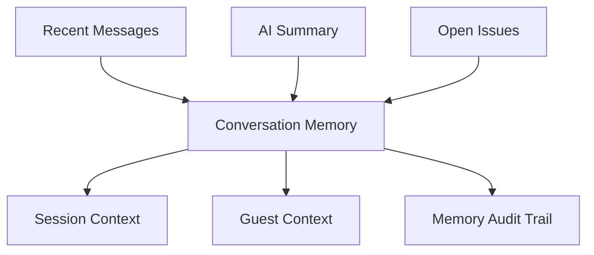

# Conversation Memory

## Business Purpose

Conversation Memory gives StayFlow AI continuity within and across guest conversations. It helps avoid repetitive questions, preserve unresolved issues, and provide context-aware responses while respecting privacy.

## User Stories

- As a guest, I want the concierge to remember what I just asked.
- As a host, I want AI to know whether an issue is already open.
- As a support user, I want summaries that make long conversations easier to review.

## Functional Requirements

- Store conversation summaries, recent message windows, unresolved intents, escalation status, and important guest-provided facts.
- Distinguish short-term session memory from longer-term guest memory.
- Link memory to company, guest, property, reservation, and conversation.
- Refresh summaries when material conversation events occur.
- Exclude sensitive or irrelevant content from AI memory.

## Non-Functional Requirements

- Memory retrieval must be fast and scoped to the correct conversation.
- Memory must not leak across companies, guests, or properties.
- Summaries must be auditable and identify whether they are AI-generated.
- Memory retention must align with privacy policy.

## Validation Rules

- Memory must include scope and source metadata.
- AI-generated memory must not overwrite original messages.
- Sensitive facts must be redacted or excluded.
- Stale memory should be refreshed or marked as outdated.

## Edge Cases

- Guest changes topic abruptly.
- Multiple guests use one WhatsApp thread.
- AI summary misses a critical detail.
- Human support resolves an issue outside the conversation.
- Guest requests deletion of conversation history.

## Acceptance Criteria

- Conversation Memory documentation distinguishes session, guest, and operational memory.
- Memory supports continuity without becoming an uncontrolled data store.
- Privacy and retention expectations are explicit.

## Future Enhancements

- Memory quality scoring.
- User-visible summary review.
- Automatic unresolved-issue tracking.
- Retention-aware memory pruning.

