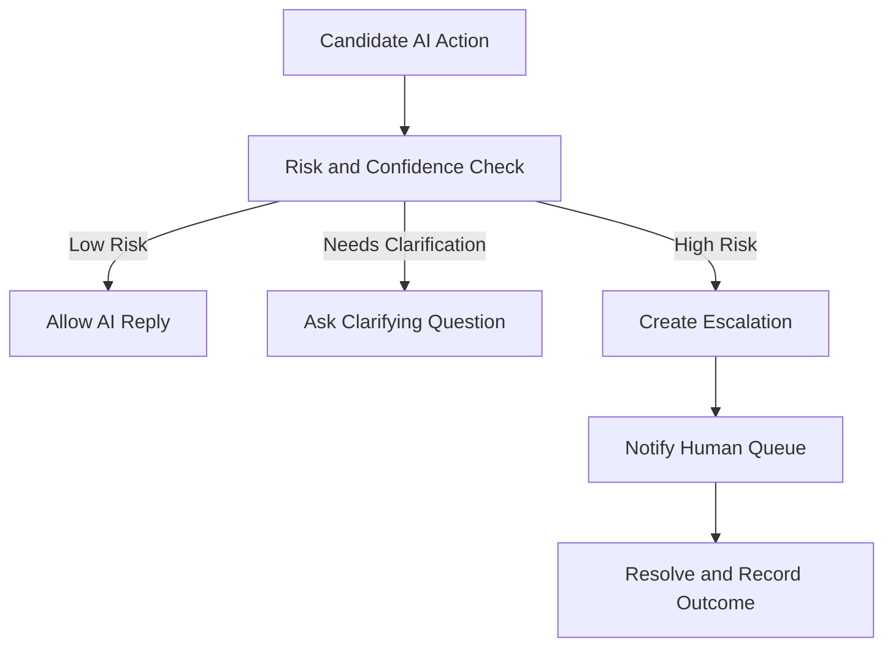

# Escalation Engine

## Business Purpose

The Escalation Engine identifies when AI should stop, ask for clarification, or involve a human. It protects guests, hosts, and the business from unsafe automation while keeping operations responsive.

## User Stories

- As a guest, I want urgent or sensitive issues handled by a person quickly.
- As a host, I want AI to escalate cases it cannot resolve safely.
- As an operations user, I want escalations routed with enough context to act.

## Functional Requirements

- Detect escalation triggers such as emergencies, safety concerns, payment disputes, legal threats, access failures, abusive content, low confidence, and policy exceptions.
- Create escalation records with guest, property, reservation, conversation, reason, urgency, and summary.
- Notify the appropriate host, manager, or support queue.
- Pause or limit AI replies after escalation when needed.
- Track escalation status and resolution notes.

## Non-Functional Requirements

- Escalation detection must prioritize guest safety and operational risk.
- Escalation records must be auditable and company isolated.
- Urgent escalation routing must be reliable and observable.
- AI should avoid repeated automatic replies while a human is handling the issue.

## Validation Rules

- Escalation reason and urgency must be recorded.
- Emergency escalation must include property and guest contact context when available.
- Escalated conversations must respect opt-out and privacy settings.
- Resolved escalation should be linked back to the conversation timeline.

## Edge Cases

- Guest reports an emergency with incomplete location information.
- Guest uses sarcasm or unclear wording.
- AI confidence is high but knowledge source is stale.
- Host does not respond to escalation.
- Multiple escalations are created for the same issue.

## Acceptance Criteria

- Escalation Engine documentation defines triggers, routing, status, and resolution needs.
- Human handoff is a first-class AI domain outcome.
- Urgent and high-risk scenarios are routed away from unsupervised AI response.

## Future Enhancements

- Escalation SLA tracking.
- On-call routing schedules.
- Escalation deduplication.
- Priority scoring based on guest, property, and issue type.

