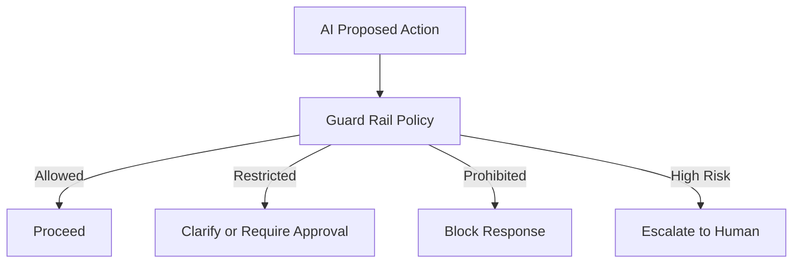

# Guard Rails

## Business Purpose

Guard rails define the boundaries of acceptable AI behavior in StayFlow AI. They protect guest safety, host operations, privacy, compliance, and product trust.

## User Stories

- As a guest, I want the concierge to avoid unsafe or misleading advice.
- As a host, I want AI to stay within approved operating rules.
- As an administrator, I want guard rails that can be reviewed, tested, and improved.

## Functional Requirements

- Define prohibited, restricted, and allowed AI behaviors.
- Enforce privacy, company isolation, safety, payment, legal, and emergency rules.
- Block or escalate high-risk content.
- Support configurable policies per company in future iterations.
- Log guard rail decisions with reason and correlation identifiers.

## Non-Functional Requirements

- Guard rails must be applied consistently across AI workflows.
- Guard rail rules must be maintainable and testable.
- Guard rails must fail closed when uncertainty is high.
- Guard rail decisions must be observable for quality and compliance review.

## Validation Rules

- AI must not provide medical, legal, or financial advice beyond approved operational guidance.
- AI must not invent booking status, prices, refunds, access codes, or emergency contacts.
- AI must not disclose guest personal data to unauthorized parties.
- AI must escalate threats, self-harm, violence, emergencies, abuse, and legal disputes.
- AI must not override host approval requirements for refunds, discounts, extensions, or exceptions.

## Edge Cases

- Guest asks for a discount or refund using emotional pressure.
- Guest requests another guest's information.
- Guest asks for emergency help but location is unclear.
- Host knowledge base contains unsafe or contradictory guidance.
- AI detects a policy violation after a response has already been drafted.

## Acceptance Criteria

- Guard Rails documentation defines prohibited and restricted AI behavior.
- Guard rails cover privacy, safety, payments, legal, emergency, and operational authority boundaries.
- Guard rail failures result in blocking, clarification, or escalation.

## Future Enhancements

- Policy management UI.
- Automated guard rail test cases.
- Company-specific risk tolerance settings.
- Guard rail analytics and trend reporting.

