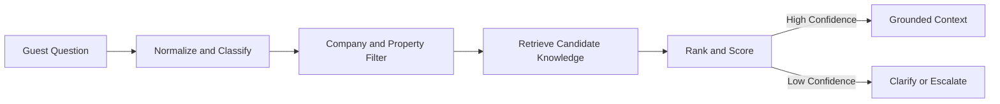

# Knowledge Retrieval

## Business Purpose

Knowledge Retrieval finds the most relevant company and property knowledge for a guest question. It ensures AI answers are grounded in approved content instead of generic assumptions.

## User Stories

- As a guest, I want accurate answers about the property I booked.
- As a host, I want AI to use my knowledge base, house rules, amenities, recommendations, and emergency contacts.
- As an operations user, I want to identify missing knowledge when AI cannot answer.

## Functional Requirements

- Retrieve relevant property knowledge articles, amenities, house rules, recommendations, emergency contacts, and reservation policies.
- Filter knowledge by company, property, active status, visibility, and guest eligibility.
- Rank results by relevance, freshness, confidence, and source quality.
- Return citations or source references for generated answers.
- Detect no-match and low-confidence retrieval outcomes.

## Non-Functional Requirements

- Retrieval must be performant for real-time conversations.
- Retrieval must enforce tenant and property boundaries.
- Results should be explainable enough for support review.
- Retrieval should tolerate spelling mistakes and natural guest phrasing.

## Validation Rules

- Only active and approved knowledge should be used for automatic AI responses.
- Emergency knowledge must be prioritized when relevant.
- Access-sensitive knowledge must be shared only with eligible guests.
- Low-confidence retrieval must trigger clarification or escalation.

## Edge Cases

- Multiple knowledge articles conflict.
- Property knowledge is missing or outdated.
- Guest asks about a nearby service not listed in recommendations.
- Guest uses slang, abbreviations, or a different language.
- Knowledge article is active but not suitable for guest-facing response.

## Acceptance Criteria

- Knowledge Retrieval documentation defines source filtering, ranking, and confidence behavior.
- AI answers can be grounded in approved StayFlow knowledge.
- Retrieval failures can produce safe clarification or escalation paths.

## Future Enhancements

- Vector search and hybrid keyword retrieval.
- Knowledge freshness scoring.
- Missing-knowledge analytics.
- Host review workflow for low-confidence answers.

