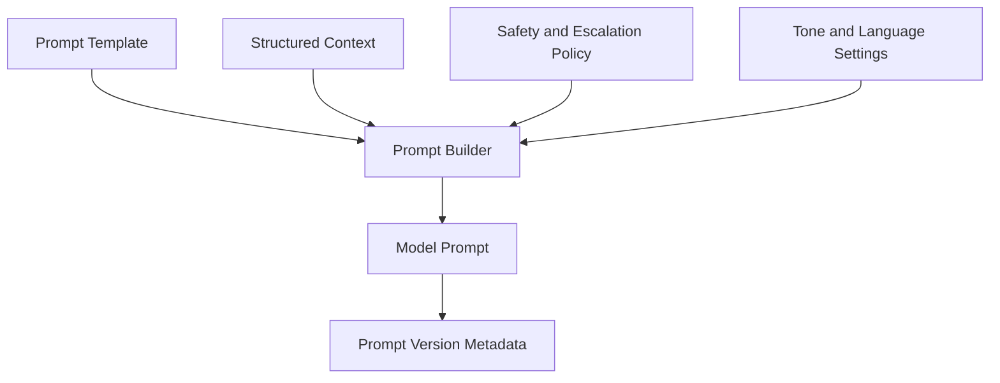

# Prompt Builder

## Business Purpose

The Prompt Builder transforms structured context into controlled instructions for the AI model. It ensures responses follow StayFlow AI's tone, safety requirements, company policies, and WhatsApp formatting expectations.

## User Stories

- As a host, I want AI responses to sound professional and helpful.
- As a guest, I want concise WhatsApp answers that directly address my question.
- As an administrator, I want prompts to be versioned and governed.

## Functional Requirements

- Build prompts from approved templates, context packages, policy instructions, and response constraints.
- Support language, tone, format, and escalation instructions.
- Include source-grounding instructions and uncertainty handling.
- Version prompt templates.
- Record prompt metadata for audit and quality review.

## Non-Functional Requirements

- Prompts must avoid unnecessary personal data.
- Prompt templates must be maintainable and testable.
- Prompt construction must be deterministic for a given context package and template version.
- Prompt size must be controlled to manage cost and latency.

## Validation Rules

- Prompt Builder must only use context approved by the Context Builder.
- Prompt must include instructions to avoid fabrication.
- High-risk topics must include escalation guidance.
- Prompt template version must be recorded with model call metadata.

## Edge Cases

- Context package exceeds token budget.
- Guest language differs from property default language.
- Host policy conflicts with generic assistant instructions.
- Prompt template is missing or disabled.
- Model provider supports different prompt formatting.

## Acceptance Criteria

- Prompt Builder documentation defines template, versioning, formatting, and safety expectations.
- Prompts are treated as governed product artifacts.
- Prompt construction supports auditability and future testing.

## Future Enhancements

- Prompt A/B testing.
- Company-level tone configuration.
- Prompt linting and regression tests.
- Dynamic prompt compression.

