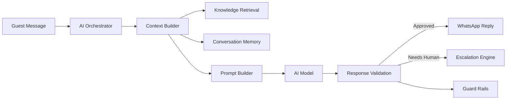

# AI Product Documentation

This folder defines the AI domain for StayFlow AI. It describes how the platform should use AI to understand WhatsApp guest conversations, build safe context, retrieve property knowledge, generate responses, validate outputs, and escalate to human operators when needed.

## Documents

- [AI Overview](AIOverview.md)
- [AI Orchestrator](AIOrchestrator.md)
- [Context Builder](ContextBuilder.md)
- [Prompt Builder](PromptBuilder.md)
- [Knowledge Retrieval](KnowledgeRetrieval.md)
- [Conversation Memory](ConversationMemory.md)
- [Escalation Engine](EscalationEngine.md)
- [Response Validation](ResponseValidation.md)
- [Guard Rails](GuardRails.md)
- [Acceptance Criteria](AcceptanceCriteria.md)

## Business Purpose

The AI domain is responsible for turning fragmented hospitality data into safe, useful guest responses. It should improve host responsiveness, reduce repetitive work, and preserve guest trust through strong controls.

## Product Principles

- Use AI to assist, not to hide uncertainty.
- Ground responses in company, property, reservation, and guest context.
- Prefer escalation over risky or unsupported answers.
- Minimize personal data in prompts and logs.
- Make AI decisions observable enough for support and quality review.
