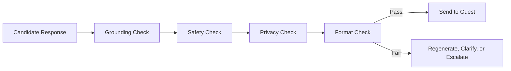

# Response Validation

## Business Purpose

Response Validation checks AI-generated responses before they are sent to guests. It reduces hallucinations, policy violations, unsafe advice, privacy leaks, and brand-damaging messages.

## User Stories

- As a guest, I want AI answers to be accurate and safe.
- As a host, I want AI to avoid unsupported promises.
- As an administrator, I want validation failures to be logged and actionable.

## Functional Requirements

- Validate generated responses for grounding, safety, tone, privacy, policy compliance, and formatting.
- Compare response claims against retrieved context where possible.
- Detect unsupported access details, pricing, refunds, availability, and emergency guidance.
- Route failed validations to clarification, regeneration, or escalation.
- Record validation result, reason, and model metadata.

## Non-Functional Requirements

- Validation must add minimal latency to the guest experience.
- Validation rules must be testable and versioned.
- Validation must be company isolated and privacy aware.
- Validation failures must be observable for quality improvement.

## Validation Rules

- Responses must not include data outside the conversation's company scope.
- Responses must not claim certainty when retrieved context is low confidence.
- Responses must not include sensitive guest data unnecessarily.
- Responses must follow WhatsApp-friendly formatting.
- Failed validation must prevent automatic sending.

## Edge Cases

- Response is polite but factually unsupported.
- Response includes outdated policy from memory.
- Response answers two guest questions but misses an urgent third issue.
- Response language differs from the guest's language.
- Validation provider fails or times out.

## Acceptance Criteria

- Response Validation documentation defines what is checked before guest delivery.
- Failed validation has clear product outcomes.
- Validation supports auditability and continuous quality improvement.

## Future Enhancements

- Automated factuality scoring.
- Human review queue for failed responses.
- Regression test suite for response validation.
- Validation analytics by property and intent.

