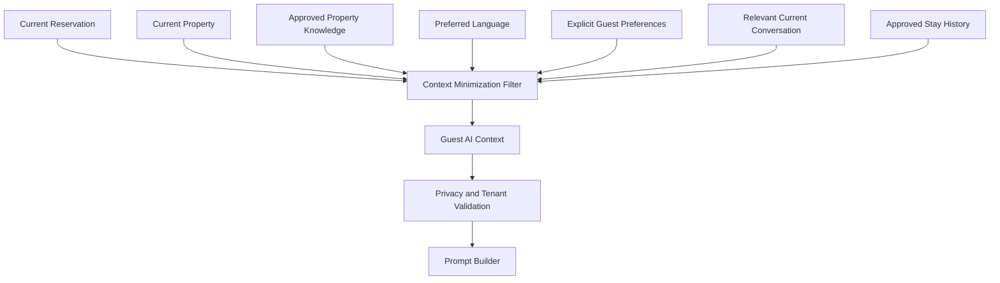

# Guest AI Context

## Executive Summary

Guest AI Context defines how StayFlow AI builds privacy-safe, guest-specific context for AI concierge responses. The context should be current, relevant, minimized, company-scoped, and grounded in approved data.

## Business Purpose

AI personalization improves guest support only when it is accurate and respectful. This document defines what guest context may be used, what must be excluded, and how to avoid turning sensitive personal data into uncontrolled memory.

## Scope

In scope: current reservation, current property, approved property knowledge, preferred language, explicit guest preferences, relevant current conversation context, approved stay history information, minimization rules, and excluded data categories.

Out of scope: model provider implementation, prompt engineering details, and unrestricted long-term memory.

## Actors

- Guest.
- AI concierge.
- Context builder.
- Prompt builder.
- Host.
- Support agent.
- Security reviewer.

## User Stories

- As a guest, I want AI responses in my preferred language where possible.
- As a host, I want AI answers grounded in the current property and reservation.
- As a security reviewer, I want sensitive guest data excluded from prompts by default.
- As an AI workflow, I need clear rules for using preferences and stay history.

## Functional Requirements

- Build AI context from current reservation, current property, approved property knowledge, guest preferred language, explicit preferences, relevant current conversation context, and approved stay history.
- Exclude unauthorized, stale, sensitive, or irrelevant data.
- Label context sources as operational data, guest-provided preference, conversation context, or AI-derived observation.
- Respect AI personalization disabled setting.
- Flag low-confidence or ambiguous context for clarification or escalation.

## Non-Functional Requirements

- Context building must be low latency for WhatsApp.
- Context must be deterministic and auditable.
- Prompt payloads should be concise to reduce cost and privacy exposure.
- Context retrieval must enforce company scope.

## Business Rules

- Current reservation and property context are primary grounding sources.
- Approved property knowledge should take precedence over generic AI knowledge.
- Guest preferred language may be used for response language selection.
- Explicit preferences may be used only when relevant and allowed.
- AI-derived observations must not become permanent preferences without explicit business rule and consent.

## Validation Rules

- Company scope is required before context retrieval.
- Current reservation must match the guest and company.
- Property knowledge must be active and approved.
- Personal data must be excluded unless required for the specific workflow.
- AI personalization disabled must remove optional preference and historical context.

## Error Handling

- Missing current reservation should trigger clarification if reservation context is needed.
- Conflicting guest matches should block AI response and escalate.
- Stale property knowledge should be omitted or flagged.
- If context minimization fails, the response must not be sent automatically.

## Security Considerations

AI context can expose sensitive data to a third-party provider. Context assembly must follow [ADR-0003](../../decisions/ADR-0003-use-openai.md), tenant isolation, and audit logging practices.

## Privacy Considerations

Do not send payment credentials, government IDs, full historical transcripts, unrestricted notes, sensitive health details, unrelated stay history, other guests' information, or cross-company data unless a specific workflow requires a minimal field and policy allows it.

## Multi-Tenant Considerations

AI context must be company-scoped. A prompt for Company A must never include Company B guest, property, reservation, conversation, or knowledge data.

## AI Considerations

AI should be instructed to answer only from provided context, admit uncertainty, ask clarifying questions, or escalate. Current context is preferred over long-term memory.

## Edge Cases

- Multiple reservations match the same guest.
- Guest asks about another guest.
- Guest disables AI personalization.
- Knowledge base conflicts with conversation context.
- Relevant preference is sensitive or unconfirmed.

## Future Enhancements

- Context trace viewer.
- Automated sensitivity classification.
- Prompt regression tests.
- Guest-controlled personalization settings.

## Acceptance Criteria

- Allowed and excluded AI context sources are documented.
- Context minimization and privacy-by-design principles are explicit.
- AI personalization disabled behavior is defined.
- Ambiguous context produces clarification or escalation.

