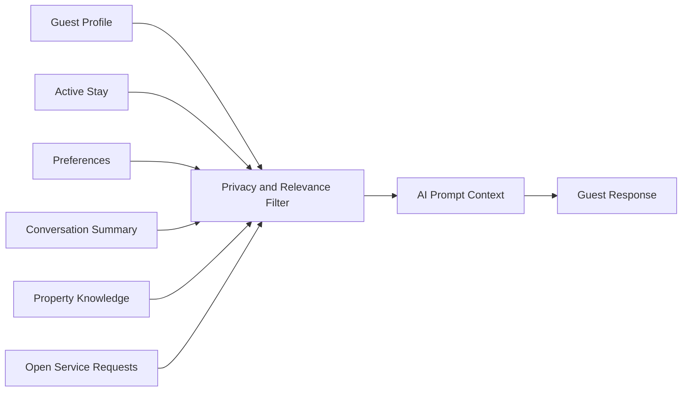

# Guest AI Context

## Business Purpose

Guest AI context defines the subset of guest information that can safely and usefully support AI concierge responses. It should help the assistant answer with awareness while preventing excessive exposure of personal data.

## User Stories

- As a guest, I want AI responses to reflect my stay without exposing unnecessary personal data.
- As a host, I want the AI concierge to consider guest preferences and stay status.
- As an administrator, I want clear rules for which guest data can enter prompts.

## Functional Requirements

- Assemble AI context from guest profile, active stay, preferences, conversation summary, property knowledge, and open service requests.
- Exclude sensitive data unless explicitly allowed and necessary.
- Label context sources as guest-provided, host-entered, system-generated, or AI-inferred.
- Refresh context when profile, stay, property, or conversation data changes.
- Track generated summaries and prompt context metadata where appropriate.

## Non-Functional Requirements

- Context assembly must be fast enough for real-time WhatsApp replies.
- Prompt context must be deterministic, auditable, and company isolated.
- Context should be concise to control model cost and reduce hallucination risk.
- Privacy and security rules must be enforced before model calls.

## Validation Rules

- AI context must include company and property boundaries.
- Guest identity should be minimized to what is needed for the response.
- Inferred preferences should be marked and treated with lower confidence.
- Stale or conflicting context should be resolved before prompt assembly.

## Edge Cases

- Guest asks a question unrelated to the current property.
- Multiple active stays appear for the same phone number.
- Guest preference conflicts with house rules.
- Conversation summary omits an important escalation.
- Context contains sensitive information that should be redacted.

## Acceptance Criteria

- AI context documentation defines allowed data sources and exclusion principles.
- Requirements support real-time concierge responses and privacy-safe prompt assembly.
- Edge cases capture conflict, stale context, and identity ambiguity.

## Future Enhancements

- Context relevance scoring.
- Prompt trace viewer for support audits.
- Guest-controlled personalization settings.
- Automated redaction and sensitivity classification.

