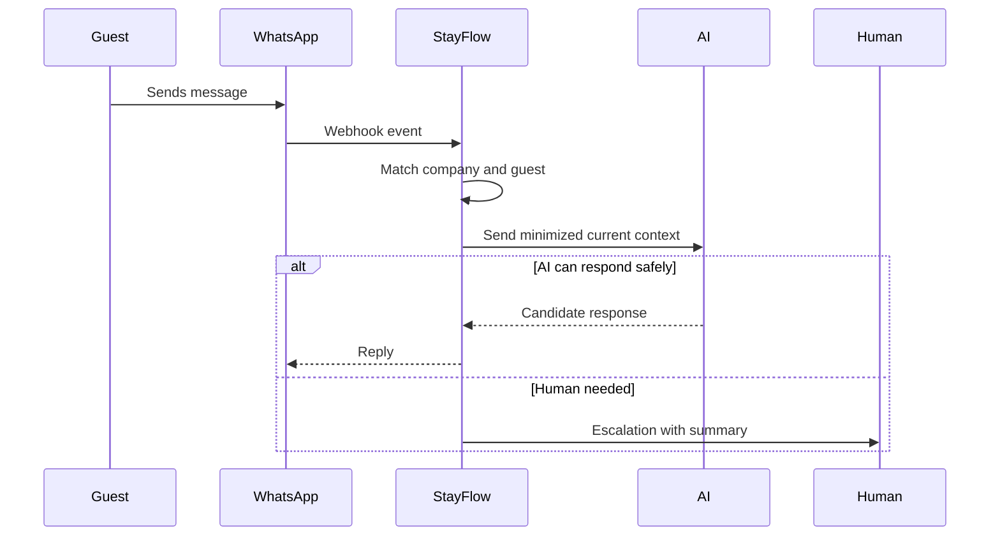

# Guest Communication

## Executive Summary

Guest Communication records WhatsApp and future channel interactions between guests, AI, hosts, and support agents. It supports service continuity, human escalation, consent tracking, and AI conversation context.

## Business Purpose

Communication history lets StayFlow AI answer consistently, avoid repeated questions, and help operators understand unresolved guest needs.

## Scope

In scope: inbound and outbound messages, WhatsApp identifiers, conversation summaries, consent signals, escalation status, service request links, reservation context, and communication metadata.

Out of scope: storing unrestricted sensitive data, using all past conversations as AI memory, or bypassing WhatsApp policy requirements.

## Actors

- Guest.
- AI concierge.
- Host.
- Support agent.
- WhatsApp Cloud API integration.
- Escalation workflow.

## User Stories

- As a guest, I want support to understand my current issue without making me repeat everything.
- As a host, I want to see recent guest messages and escalations.
- As an AI workflow, I need relevant current conversation context without exposing excessive history.

## Functional Requirements

- Track conversation records by company, guest, reservation, and channel.
- Store message direction, timestamp, delivery status, WhatsApp identifiers, and correlation IDs.
- Support conversation summaries and unresolved issue markers.
- Track opt-in, opt-out, and consent-related communication events.
- Link communication to service requests and escalations.

## Non-Functional Requirements

- Message processing should be idempotent for duplicate webhooks.
- Communication history must be searchable and auditable.
- Provider failures should be handled gracefully per [ADR-0004](../../decisions/ADR-0004-use-whatsapp-cloud-api.md).
- Sensitive data in logs must be minimized.

## Business Rules

- Current conversation context is distinct from permanent guest preferences.
- AI summaries must not overwrite source messages.
- Opt-out status must prevent non-essential outbound messaging.
- Human escalation may pause or constrain AI replies.

## Validation Rules

- Every conversation must belong to a company.
- WhatsApp messages should include provider message identifiers when available.
- Reservation association should be recorded when known.
- AI-generated summaries should include generation metadata.

## Error Handling

- Duplicate webhook events should not create duplicate messages.
- Missing guest match should create a reviewable conversation candidate.
- Failed outbound messages should be retried or escalated based on policy.
- Ambiguous conversation ownership should block AI response until resolved.

## Security Considerations

Communication history can contain personal and sensitive details. Access should be authorized, company-scoped, and logged for sensitive support actions.

## Privacy Considerations

Conversation context should be retained according to policy and minimized when used for AI. Sensitive guest statements should not automatically become preferences or profile data.

## Multi-Tenant Considerations

Conversation queries must filter by company. WhatsApp identifiers must not create cross-company data sharing.

## AI Considerations

AI may use recent, relevant conversation context and approved summaries. AI should not receive full historical transcripts unless required for a specific workflow and allowed by privacy rules.

## Edge Cases

- Guest sends multiple rapid messages.
- Guest uses a shared WhatsApp number.
- Message contains payment credentials or sensitive personal information.
- Human replies while AI is processing.
- Provider webhook arrives out of order.

## Future Enhancements

- Conversation sentiment and urgency scoring.
- Escalation SLA tracking.
- Redaction of sensitive message content.
- Multi-channel communication history.

## Acceptance Criteria

- Communication history is separated from profile preferences.
- WhatsApp identification is documented.
- Idempotency and provider failure behavior are covered.
- AI context use is minimized and scoped.

