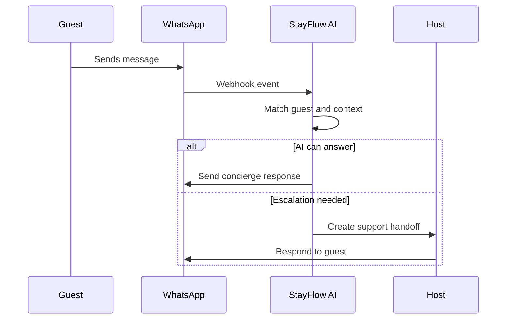

# Guest Communication

## Business Purpose

Guest communication records provide the operational context behind WhatsApp concierge interactions, support escalations, and service quality review. The domain should help teams understand what was said, what was resolved, and when human intervention is needed.

## User Stories

- As a guest, I want consistent support even if a different team member responds.
- As a host, I want to know recent guest conversations and unresolved issues.
- As a support user, I want communication history linked to guest and property context.

## Functional Requirements

- Link guest records to conversations, messages, service requests, and escalation events.
- Track communication channel, direction, timestamps, status, and resolution outcome.
- Support summaries for long conversations.
- Record opt-in, opt-out, and consent signals for messaging.

## Non-Functional Requirements

- Communication history must be searchable and auditable.
- Message data must be retained according to privacy and retention policy.
- AI summaries must be distinguishable from original guest messages.
- Sensitive data should be redacted where appropriate.

## Validation Rules

- Every communication record must belong to a company.
- WhatsApp communications should include a normalized phone number or external message identifier.
- Opt-out status must prevent non-essential outbound messaging.
- AI-generated summaries should include generation metadata.

## Edge Cases

- Guest contacts from a different phone number.
- Guest sends voice notes, images, or attachments.
- WhatsApp delivery fails or is delayed.
- A conversation switches from AI to human support.
- Guest sends sensitive personal or payment data in chat.

## Acceptance Criteria

- Communication documentation supports WhatsApp-first guest operations.
- Requirements cover consent, summaries, escalation, and auditability.
- Edge cases identify channel reliability and privacy concerns.

## Future Enhancements

- Conversation sentiment tracking.
- SLA timers for escalated support.
- Message templates by lifecycle stage.
- Omnichannel communication history.

