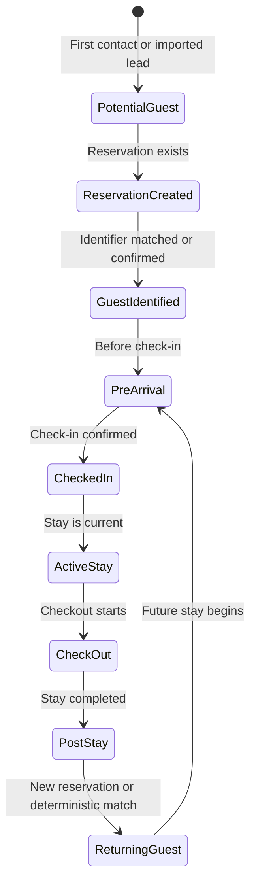

# Guest Lifecycle

## Executive Summary

The Guest lifecycle describes how a person moves from unknown or potential guest to identified guest, active stay participant, post-stay contact, and returning guest. The lifecycle informs reservation workflows, WhatsApp messaging, AI context, retention, and operational follow-up.

## Business Purpose

A clear lifecycle lets StayFlow AI send the right support at the right time, avoid premature use of personal data, and recognize returning guests without confusing records across companies.

## Scope

In scope: lifecycle states, reservation-triggered transitions, check-in and checkout milestones, returning guest recognition, consent-aware post-stay workflows, and retention implications.

Out of scope: implementing reservation APIs, booking platform sync, or automated marketing campaigns.

## Actors

- Guest.
- Host.
- Property manager.
- Reservation workflow.
- WhatsApp integration.
- AI concierge.

## User Stories

- As a guest, I want pre-arrival help once my reservation exists.
- As a host, I want guests recognized when they return.
- As a property manager, I want the lifecycle to reflect reservation status.
- As an AI workflow, I need lifecycle state to decide what context is safe and relevant.

## Functional Requirements

- Support lifecycle states: Potential Guest, Reservation Created, Guest Identified, Pre-Arrival, Checked In, Active Stay, Check-Out, Post-Stay, Returning Guest.
- Link lifecycle changes to reservation state where possible.
- Record key timestamps such as first contact, reservation association, check-in, checkout, and last contact.
- Use lifecycle state to guide AI context, messaging eligibility, and escalation.

## Non-Functional Requirements

- Lifecycle transitions must be auditable.
- Lifecycle state must be company-scoped.
- Lifecycle computation should be deterministic from reservation and guest facts.
- Messaging and AI workflows should degrade safely when lifecycle state is ambiguous.

## Business Rules

- A Potential Guest may exist before a confirmed reservation if WhatsApp contact starts early.
- Reservation Created does not guarantee Guest Identified unless identifiers match or the guest is manually confirmed.
- Returning Guest applies only within the same company for MVP.
- Post-Stay communication must respect consent and opt-out state.

## Validation Rules

- Checked In requires an associated reservation.
- Active Stay requires a current reservation and property through that reservation.
- Check-Out cannot precede check-in unless manually corrected with audit reason.
- Returning Guest must be based on a prior stay or deterministic guest identity match.

## Error Handling

- If reservation and guest identifiers conflict, flag the record for review.
- If lifecycle transition fails because data is missing, keep the prior state and create an operational warning.
- If external booking data arrives out of order, preserve audit trail and apply idempotent transition rules.

## Security Considerations

Lifecycle state can reveal occupancy information. Access must be limited to authorized company users and workflows.

## Privacy Considerations

Post-stay and returning guest workflows must respect retention policy, guest consent, and AI personalization settings.

## Multi-Tenant Considerations

Lifecycle is computed only from records within the same company. No lifecycle transition may use another company's guest, reservation, or property data.

## AI Considerations

AI context should vary by lifecycle. For example, pre-arrival can include check-in preparation, active stay can include current property knowledge, and post-stay should avoid unnecessary operational details unless the guest asks. Reservation-specific lifecycle context must be resolved through [ADR-0007](../../decisions/ADR-0007-reservation-context-resolution.md) before AI receives stay-specific context.

## Edge Cases

- Guest contacts support before reservation import.
- Reservation is cancelled after pre-arrival messaging.
- Guest checks in early.
- Guest extends stay after checkout reminders.
- Same guest returns using a different phone number.

## Future Enhancements

- Automated lifecycle events from booking platforms.
- Lifecycle-based WhatsApp templates.
- Guest re-engagement rules.
- Retention-aware lifecycle cleanup.

## Acceptance Criteria

- Lifecycle states match the documented flow.
- Mermaid diagram is present.
- Returning guest identification remains company-scoped.
- Lifecycle state can guide AI context and messaging.

