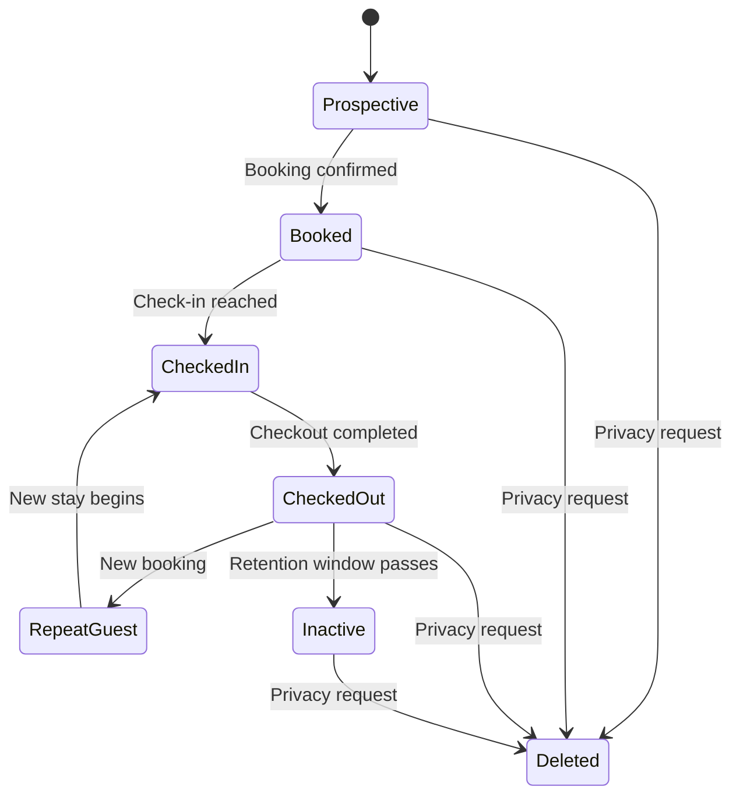

# Guest Lifecycle

## Business Purpose

The guest lifecycle defines how StayFlow AI manages a guest from first contact through active stay support, post-stay follow-up, repeat visits, and deletion or anonymization requests.

## User Stories

- As a host, I want new guest records created when guests first contact the concierge.
- As an operations user, I want guest status to show whether a guest is upcoming, currently staying, completed, inactive, or deleted.
- As a guest, I want my data handled appropriately after my stay ends.

## Functional Requirements

- Support lifecycle states for prospective, booked, checked in, checked out, repeat, inactive, and deleted guests.
- Record lifecycle timestamps such as first contact, last contact, check-in, checkout, and deletion.
- Allow transitions based on booking updates, conversation events, and manual operations.
- Preserve audit history for lifecycle changes.

## Non-Functional Requirements

- Lifecycle transitions must be deterministic and traceable.
- State changes must not expose guest data across companies.
- Lifecycle reads should be efficient for dashboards and automation triggers.

## Validation Rules

- A checked-in guest should have an associated property or stay context.
- Checkout date should not be earlier than check-in date.
- Deleted guests should not be available for normal concierge workflows.
- Inactive records should remain auditable.

## Edge Cases

- A guest contacts the concierge before a booking exists.
- A guest extends the stay after checkout was scheduled.
- A booking is cancelled after the guest has already interacted with WhatsApp.
- A guest returns after being marked inactive.
- A deletion request conflicts with legal retention obligations.

## Acceptance Criteria

- Lifecycle states are documented with clear transition expectations.
- Edge cases are identified for booking, messaging, and privacy workflows.
- Future implementation can map lifecycle changes to events and audit logs.

## Future Enhancements

- Automated lifecycle transitions from booking platform integrations.
- Lifecycle-based messaging automation.
- Re-engagement journeys for repeat guests.
- Retention policy automation.

