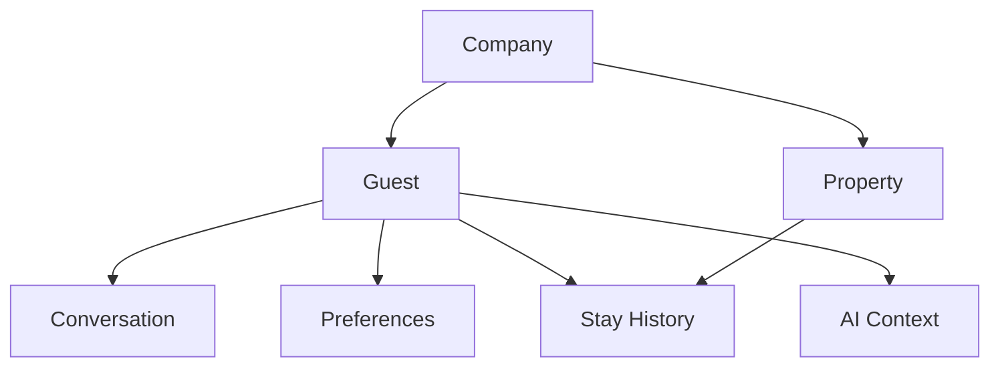

# Guest Overview

## Business Purpose

The Guest domain represents people who interact with StayFlow AI before, during, and after a stay. It allows Airbnb hosts and property managers in Kenya to provide faster support, maintain continuity across conversations, and personalize service without relying on scattered manual notes.

## User Stories

- As a host, I want each guest profile connected to my company so my team can manage guests without mixing tenant data.
- As a guest, I want the concierge to understand my stay context so responses are relevant and efficient.
- As a property manager, I want a complete guest view so I can resolve requests and identify recurring needs.
- As an administrator, I want guest records to be auditable so support decisions can be reviewed.

## Functional Requirements

- Capture core guest identity and contact details.
- Associate guests with a company and, when applicable, one or more properties and stays.
- Support active, inactive, and soft-deleted guest records.
- Provide a foundation for preferences, communication history, stay history, privacy controls, and AI context.
- Support search by name, phone number, email, company, property, and recent activity.

## Non-Functional Requirements

- Guest lookup must be optimized for WhatsApp phone-number matching.
- Guest data must be isolated by company.
- Personal data must be protected using access control, audit logging, and secure storage practices.
- The model must support future integration with booking platforms and CRM tools.

## Validation Rules

- A guest must belong to a company.
- At least one reachable contact method should be available before concierge messaging is enabled.
- Phone numbers should use normalized international format where possible.
- Duplicate detection should consider phone number, email, and company scope.

## Edge Cases

- A guest shares a phone number with a family member.
- A guest uses different names across Airbnb, WhatsApp, and direct booking records.
- A repeat guest stays at several properties.
- Guest data is imported before a booking is fully confirmed.
- Guest asks to stop receiving messages.

## Acceptance Criteria

- Guest documentation clearly defines the domain purpose and expected data boundaries.
- The domain supports multi-tenant company isolation.
- Guest records can support current concierge needs and future operational workflows.

## Future Enhancements

- Guest merge workflows.
- Guest tags and segmentation.
- Loyalty and repeat-stay indicators.
- Booking platform identity matching.

