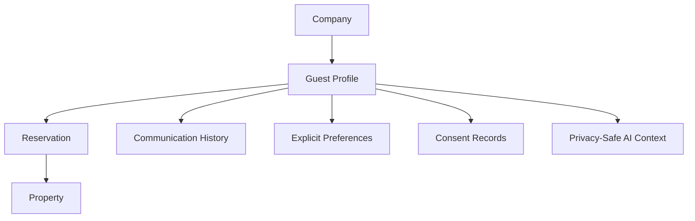

# Guest Overview

## Executive Summary

The Guest domain represents people who interact with StayFlow AI before, during, and after a reservation. It enables WhatsApp identification, returning guest recognition, guest preferences, communication continuity, stay history, privacy controls, and AI personalization boundaries.

## Business Purpose

Guests are central to StayFlow AI because the product exists to help hosts and property managers deliver responsive hospitality at scale. The domain turns fragmented guest information into company-scoped operational context while protecting guest privacy.

## Scope

In scope: guest profile data, international phone numbers, WhatsApp identifiers, preferred language, email, country of residence, notes, preferences, reservations, stay history, communication history, consent, duplicate detection, profile merging, and AI context controls.

Out of scope: implementing APIs, database migrations, authentication, platform-wide guest identity, and direct booking engine behavior.

## Actors

- Guest.
- Host.
- Property manager.
- Company administrator.
- Support agent.
- AI concierge.
- WhatsApp Cloud API integration.

## User Stories

- As a guest, I want StayFlow AI to recognize my current reservation so I get relevant help.
- As a host, I want returning guests identified within my company.
- As a property manager, I want guest history linked through reservations instead of free-form notes.
- As an administrator, I want guest data isolated by company.

## Functional Requirements

- Create and maintain company-scoped guest profiles.
- Store normalized phone number, WhatsApp identifier, email, preferred language, country of residence, notes, consent status, and active status.
- Associate guests with reservations and derive property association through reservations.
- Track guest stay history and communication history.
- Detect returning guests and possible duplicates.
- Support merge review where duplicate records are suspected.

## Non-Functional Requirements

- Guest lookup by WhatsApp identifier and normalized phone number should be performant.
- Guest records must be tenant isolated.
- Guest data must be auditable when created, updated, merged, deactivated, or deleted.
- Guest context for AI must follow minimization principles from [ADR-0003](../../decisions/ADR-0003-use-openai.md).

## Business Rules

- Guest profiles are company-scoped for MVP.
- A guest may have multiple reservations under the same company.
- A guest may be associated with multiple properties only through reservations.
- Returning guest identification must use deterministic identifiers when possible.
- Notes are operational records and must not become AI memory by default.

## Validation Rules

- At least one reliable identifier should exist for a confirmed guest: normalized phone number, WhatsApp identifier, or email.
- International phone numbers should be normalized before matching.
- Email must be syntactically valid when provided.
- Preferred language should be selected from supported values.
- Country of residence should use a consistent country list or ISO-compatible value when implemented.

## Error Handling

- If no deterministic identifier exists, create a reviewable guest candidate rather than a confirmed returning guest.
- If identifiers conflict with an existing record, flag for duplicate review.
- If a guest lookup crosses company scope, reject the operation and log the security event.

## Security Considerations

Guest data is personal data. Access must be authorized, company-scoped, and auditable. Error messages should not reveal whether another company has a matching guest.

## Privacy Considerations

The domain must separate operational guest data, guest-provided preferences, conversation context, and AI-derived observations. Sensitive personal data should not be stored in notes or reused for AI personalization without a defined policy and consent.

## Multi-Tenant Considerations

Company A guest records must never be visible to Company B. Queries must filter by `CompanyId`, matching [ADR-0006](../../decisions/ADR-0006-use-multi-tenant-saas-design.md).

## AI Considerations

AI may use approved guest context only when it is relevant to the current workflow. AI-derived observations must remain temporary or reviewable unless a documented rule permits persistence.

## Edge Cases

- Shared family phone number.
- Same guest uses different email addresses.
- WhatsApp number changes between stays.
- Booking import creates an incomplete guest.
- Similar guest names exist inside the same company.

## Future Enhancements

- Guest self-service profile updates.
- Guest profile merge queue.
- Guest segmentation for retention.
- Platform-scoped identity decision ADR.

## Acceptance Criteria

- Guest records are defined as company-scoped.
- Property association is documented through reservations.
- Duplicate detection and merge review are documented.
- AI and privacy boundaries are explicit.

