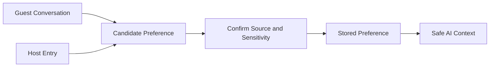

# Guest Preferences

## Business Purpose

Guest preferences help StayFlow AI deliver more personal and useful concierge experiences. Preferences should capture service-relevant choices such as language, communication timing, accessibility needs, and hospitality preferences.

## User Stories

- As a guest, I want the concierge to communicate in my preferred language.
- As a host, I want to remember repeat guest preferences so service feels consistent.
- As an operations user, I want preferences separated from private notes so they can be safely reused.

## Functional Requirements

- Store language, communication channel, quiet hours, accessibility preferences, room or amenity preferences, dietary notes, and special requests where relevant.
- Support preference updates from manual entry or guest conversation.
- Mark whether a preference is guest-confirmed, inferred, or host-entered.
- Expose only safe preferences to AI prompt context.

## Non-Functional Requirements

- Preferences must be easy to update during active guest support.
- Sensitive preferences must be protected and minimized.
- Preference reads must be efficient for AI context assembly.

## Validation Rules

- Preference source should be captured where possible.
- Sensitive preferences must not be inferred without confirmation.
- Free-text preferences should have length limits.
- Preference values should use controlled lists where practical.

## Edge Cases

- A preference applies only to one stay.
- A guest changes language preference during a conversation.
- A preference conflicts with house rules or property capabilities.
- A host records a sensitive health-related note.
- AI infers a preference incorrectly.

## Acceptance Criteria

- Preference documentation distinguishes confirmed, inferred, and host-entered preferences.
- Preferences can support personalization while preserving privacy.
- Future implementation can determine which preferences are safe for AI context.

## Future Enhancements

- Guest-facing preference confirmation.
- Preference expiration rules.
- Property-specific preference availability.
- Recommendation personalization based on stay goals.

