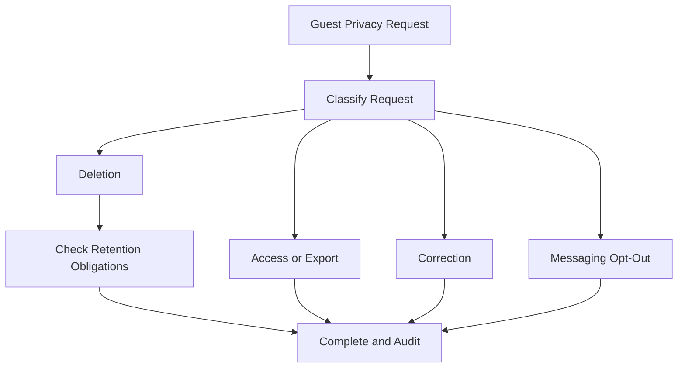

# Guest Privacy

## Business Purpose

Guest privacy defines how StayFlow AI protects personal data while enabling helpful concierge experiences. It is central to trust, regulatory readiness, and responsible AI operation.

## User Stories

- As a guest, I want to know my personal information is used only for my stay and support needs.
- As a host, I want privacy controls that reduce compliance risk.
- As an administrator, I want deletion, export, consent, and audit workflows documented before implementation.

## Functional Requirements

- Track consent for messaging, data processing, and AI-assisted support where required.
- Support guest data access, correction, deletion, and export workflows.
- Minimize sensitive data included in AI context.
- Record privacy-impacting actions in audit logs.
- Support opt-out from non-essential communication.

## Non-Functional Requirements

- Personal data must be protected in transit and at rest.
- Privacy workflows must be auditable and company isolated.
- AI context assembly must apply data minimization rules.
- Retention rules must be configurable as the product matures.

## Validation Rules

- Consent records should include status, timestamp, source, and scope.
- Deleted guests should be removed from normal operational views.
- Data export should include only records within the requesting company and guest scope.
- Sensitive fields should not be used in AI prompts unless explicitly allowed and necessary.

## Edge Cases

- A guest requests deletion during an active stay.
- A host needs records for dispute resolution after a deletion request.
- A guest withdraws consent after WhatsApp support has started.
- A data export includes AI summaries that reference another guest.
- A guest asks for correction of data imported from a booking platform.

## Acceptance Criteria

- Privacy documentation covers consent, deletion, export, correction, auditability, and AI minimization.
- Requirements prepare the domain for future security and compliance implementation.
- Edge cases address operational conflicts between service delivery and privacy rights.

## Future Enhancements

- Self-service privacy portal.
- Automated retention policy execution.
- Consent versioning.
- Privacy impact assessment workflow.

