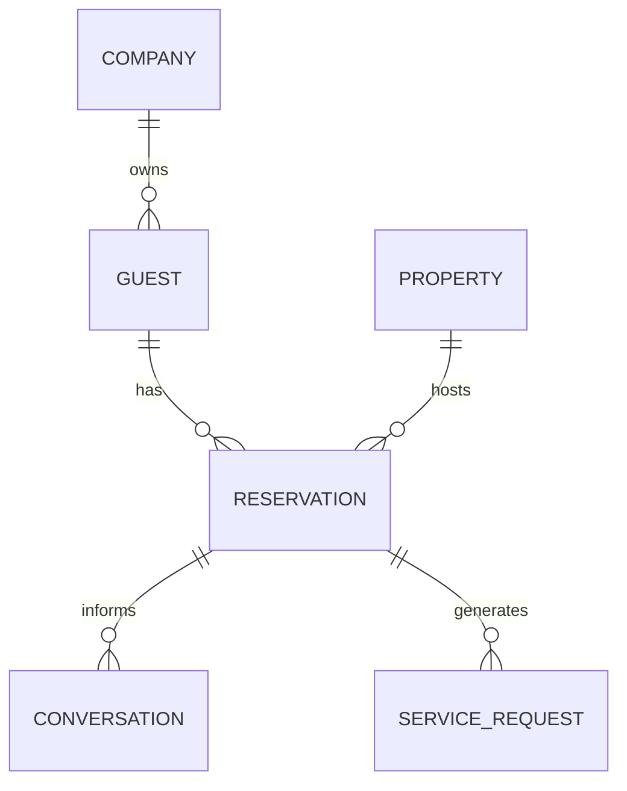

# Guest Stay History

## Executive Summary

Guest Stay History records a guest's prior and current stays through reservations. It supports returning guest identification, operational continuity, and limited AI personalization without treating every historical detail as permanent memory.

## Business Purpose

Stay history helps hosts recognize repeat guests, understand prior service issues, and tailor current support while preserving privacy and tenant isolation.

## Scope

In scope: reservation references, property association through reservations, check-in and checkout dates, stay status, prior service issues, approved stay summary, and returning guest indicators.

Out of scope: unrestricted historical chat reuse, platform-wide travel history, and guest behavior scoring without product approval.

## Actors

- Guest.
- Host.
- Property manager.
- Support agent.
- Reservation workflow.
- AI concierge.

## User Stories

- As a host, I want to know whether a guest has stayed with my company before.
- As a guest, I want repeat stays to feel smoother without unnecessary data reuse.
- As an AI workflow, I need approved stay history only when it helps answer the current question.

## Functional Requirements

- Link stay history to guest reservations.
- Derive property association from reservations.
- Track stay status, dates, source, and relevant operational outcomes.
- Support returning guest detection within a company.
- Identify approved stay history that may be used in AI context.

## Non-Functional Requirements

- Stay history queries should support guest profile views and active support workflows.
- Historical records must remain company-scoped.
- Retention policy should govern old stay data.
- Stay history summaries should be auditable.

## Business Rules

- Stay history belongs to the company that owns the reservation.
- Returning guest identification must not cross company boundaries.
- Approved stay history may be used for AI only when relevant to the current workflow.
- Sensitive incidents should not be reused as general personalization.

## Validation Rules

- Stay history must reference a guest and reservation.
- Property context must be derived from reservation.
- Checkout date must not precede check-in date.
- Approved AI history must have a source and approval flag.

## Error Handling

- Missing reservation reference should prevent confirmed stay-history creation.
- Conflicting stay dates should be flagged.
- Cross-company reservation linkage must be rejected.
- If history is stale or ambiguous, AI should not rely on it.

## Security Considerations

Stay history can reveal occupancy and travel patterns. Access must be company-scoped and role-aware.

## Privacy Considerations

Retention rules should define how long stay history remains available. Guests may request deletion or restriction subject to legal and operational obligations.

## Multi-Tenant Considerations

Company-scoped stay history prevents one host from seeing a guest's stays with another company.

## AI Considerations

AI may use approved stay history such as "returning guest" or "previously preferred late checkout" only if consent and business rules allow. AI must not receive full historical records by default.

## Edge Cases

- Split stays across multiple properties.
- Cancelled reservations with prior communication.
- Guest returns with a new phone number.
- Shared reservation with multiple guests.
- Dispute-related notes in historical stay.

## Future Enhancements

- Stay summary approval workflow.
- Retention-aware stay history cleanup.
- Returning guest dashboard indicators.
- Reservation import reconciliation.

## Acceptance Criteria

- Stay history uses reservations as the source of property association.
- Returning guest detection is company-scoped.
- AI use of history is approved and minimized.
- Retention and privacy concerns are explicit.

