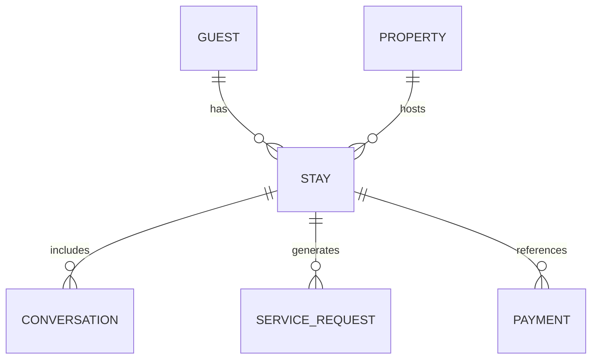

# Guest Stay History

## Business Purpose

Guest stay history gives hosts and property managers continuity across bookings. It helps identify repeat guests, previous service issues, preferred properties, and operational patterns that can improve future stays.

## User Stories

- As a host, I want to see previous stays for a guest.
- As a property manager, I want to know whether a guest had unresolved issues in a past stay.
- As a guest, I want repeat visits to feel easier because relevant history is remembered appropriately.

## Functional Requirements

- Track stay records linked to guest, company, property, and booking reference where available.
- Store check-in date, checkout date, status, guest count, source channel, and operational notes.
- Link stays to conversations, service requests, payments, and reviews when available.
- Support repeat-stay detection.

## Non-Functional Requirements

- Stay history queries must support dashboards, guest profiles, and AI context assembly.
- Historical data must remain company isolated.
- Retention rules must support privacy and legal obligations.

## Validation Rules

- Stay history must belong to one guest and one company.
- Property should be required for confirmed stays.
- Checkout date must not precede check-in date.
- Booking references should be unique within company and source where possible.

## Edge Cases

- Guest changes property after booking.
- Stay is split across multiple properties.
- Booking is cancelled after communication has started.
- Walk-in or direct guest has no external booking reference.
- Multiple guests share one booking.

## Acceptance Criteria

- Stay history documentation defines required relationships and operational value.
- Stay history can support repeat-guest recognition and AI-safe context.
- Edge cases are captured for booking changes and shared reservations.

## Future Enhancements

- Booking platform sync.
- Stay-level satisfaction indicators.
- Guest lifetime value analytics.
- Automated post-stay follow-up triggers.

