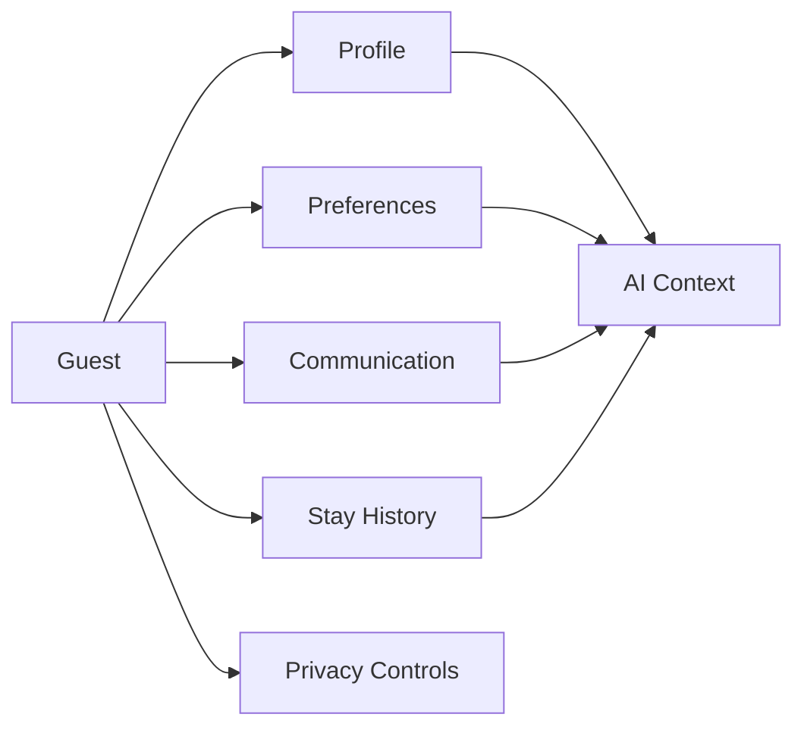

# Guest Product Documentation

This folder defines the Guest domain for StayFlow AI. It explains how guest data supports WhatsApp concierge experiences, host operations, personalization, privacy, and AI-ready context.

## Documents

- [Guest Overview](GuestOverview.md)
- [Guest Lifecycle](GuestLifecycle.md)
- [Guest Profile](GuestProfile.md)
- [Guest Preferences](GuestPreferences.md)
- [Guest Communication](GuestCommunication.md)
- [Guest Stay History](GuestStayHistory.md)
- [Guest Privacy](GuestPrivacy.md)
- [Guest AI Context](GuestAIContext.md)
- [Acceptance Criteria](AcceptanceCriteria.md)

## Business Purpose

The Guest domain enables StayFlow AI to recognize guests across stays, provide accurate support, personalize concierge responses, and protect personal information while helping hosts operate at scale.

## User Stories

- As a host, I want guest details organized by company and property so I can serve guests consistently.
- As a guest, I want the concierge to remember relevant stay context so I do not repeat information.
- As an operations user, I want guest records to support communication, preferences, and issue history.

## Functional Requirements

- Store guest identity, contact details, stay relationships, preferences, communication context, privacy consent, and AI-safe context.
- Support company isolation for every guest record.
- Support soft deletion and audit fields for operational traceability.

## Non-Functional Requirements

- Guest records must be secure, searchable, and available for concierge workflows.
- Sensitive data must be minimized in AI prompts.
- Guest lookup should be performant for phone-number based WhatsApp interactions.

## Validation Rules

- Guest records must belong to one company.
- Phone numbers must be normalized before matching.
- Required consent and privacy fields must be explicit where personal data is processed.

## Edge Cases

- A guest may use multiple phone numbers.
- A guest may stay at multiple properties under the same company.
- A guest may request deletion or data export.
- A phone number may be reused or incorrectly entered.

## Acceptance Criteria

- The guest documentation set explains profile, lifecycle, preferences, communication, stay history, privacy, AI context, and validation expectations.
- Product guidance supports future API, database, and service implementation work.

## Future Enhancements

- Guest segmentation and loyalty scoring.
- Data export workflows.
- Consent history timeline.
- Cross-channel guest identity resolution.
