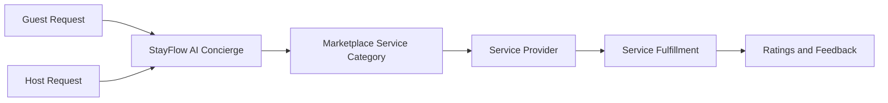

# Marketplace Product Documentation

This folder documents the StayFlow AI marketplace domain. The marketplace connects Airbnb hosts and property managers with trusted local service providers who can support guest stays and property operations in Kenya.

## Documents

- [Drivers](Drivers.md)
- [Cleaning](Cleaning.md)
- [Laundry](Laundry.md)
- [Groceries](Groceries.md)
- [Private Chef](Private-Chef.md)
- [Tour Guides](Tour-Guides.md)
- [Maintenance](Maintenance.md)

## Product Purpose

The marketplace extends the concierge beyond information delivery into coordinated services. It should help hosts respond to guest needs quickly while creating trusted local revenue opportunities for service providers.

## Product Principles

- Prioritize safety, reliability, and host approval.
- Keep pricing, availability, and provider identity transparent.
- Escalate service issues quickly.
- Track fulfillment quality through feedback and operational metrics.
