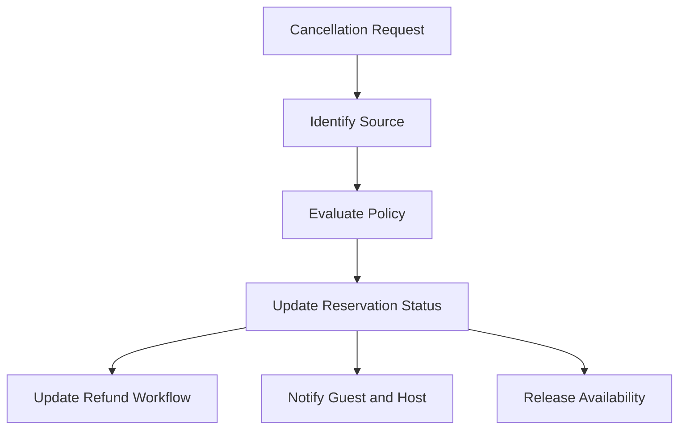

# Cancellation

## Business Purpose

Cancellation documentation defines how StayFlow AI handles reservations that are cancelled before or during a stay. It helps hosts manage availability, guest communication, refunds, and operational changes.

## User Stories

- As a guest, I want clear cancellation guidance and refund expectations.
- As a host, I want cancelled reservations removed from active stay workflows.
- As an operations user, I want cancellation reason and timing captured for reporting.

## Functional Requirements

- Store cancellation status, reason, timestamp, source, policy, refund expectation, and notes.
- Support host-initiated, guest-initiated, platform-initiated, and system-initiated cancellations.
- Update reservation lifecycle and availability context.
- Link cancellation to payments, refund workflows, and guest communication.

## Non-Functional Requirements

- Cancellation events must be auditable.
- Refund-related messaging must be accurate and avoid overpromising.
- External channel updates must be idempotent.
- Cancelled reservations must not trigger normal check-in automation.

## Validation Rules

- Cancellation must reference an existing reservation.
- Cancellation reason should be required for manual cancellation.
- Refund status must be separate from cancellation status.
- Cancelled reservations should remain visible for reporting unless deleted under policy.

## Edge Cases

- Reservation is cancelled after check-in.
- Guest disputes cancellation policy.
- Booking platform reports cancellation after local manual cancellation.
- Payment has been collected but refund status is unknown.
- Reservation is reinstated after cancellation.

## Acceptance Criteria

- Cancellation documentation separates reservation cancellation from payment refund.
- Requirements support cancellation source, reason, audit, and communication.
- Edge cases cover disputes, reinstatement, and external channel sync.

## Future Enhancements

- Cancellation policy calculator.
- Automated availability reopening.
- Refund workflow integration.
- Cancellation analytics by property and source.

