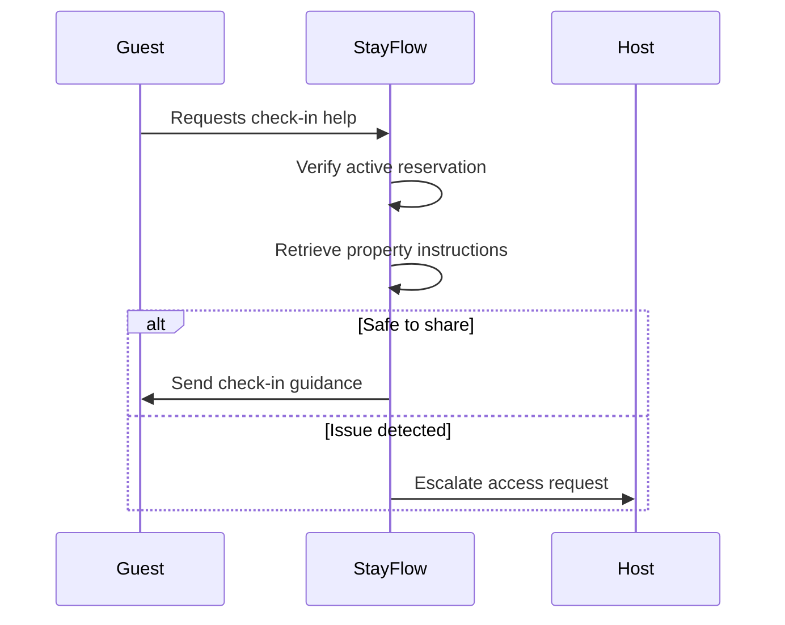

# Check-In

## Business Purpose

Check-in documentation defines the product expectations for helping guests arrive smoothly, access the property, understand house rules, and begin their stay with minimal host intervention.

## User Stories

- As a guest, I want clear arrival instructions before I reach the property.
- As a host, I want check-in readiness confirmed before the guest arrives.
- As an operations user, I want check-in status to show whether the guest has arrived or needs assistance.

## Functional Requirements

- Store expected check-in date, time window, actual check-in timestamp, method, status, and notes.
- Provide property-specific arrival instructions through AI-safe knowledge.
- Support manual confirmation of guest arrival.
- Support escalation when the guest cannot access the property.
- Link check-in status to reservation lifecycle and guest communication.

## Non-Functional Requirements

- Check-in instructions must be accurate, current, and property scoped.
- Access-related details must be protected and shared only with eligible guests.
- Check-in status must update quickly enough for live support workflows.

## Validation Rules

- Check-in details must belong to an active reservation.
- Access instructions should not be sent before the configured safe release window.
- Actual check-in timestamp cannot be before reservation creation.
- Sensitive access codes should be stored and displayed according to security policy.

## Edge Cases

- Guest arrives early.
- Guest arrives late at night.
- Access code is wrong or expired.
- Reservation dates changed but check-in instructions were already sent.
- Multiple guests in one reservation need separate arrival instructions.

## Acceptance Criteria

- Check-in requirements support arrival guidance, readiness, and escalation.
- Security-sensitive access information is treated as restricted context.
- Check-in status can drive reservation lifecycle and AI concierge behavior.

## Future Enhancements

- Automated pre-arrival checklists.
- Smart lock integration.
- Arrival verification through WhatsApp.
- Location-aware arrival assistance.

