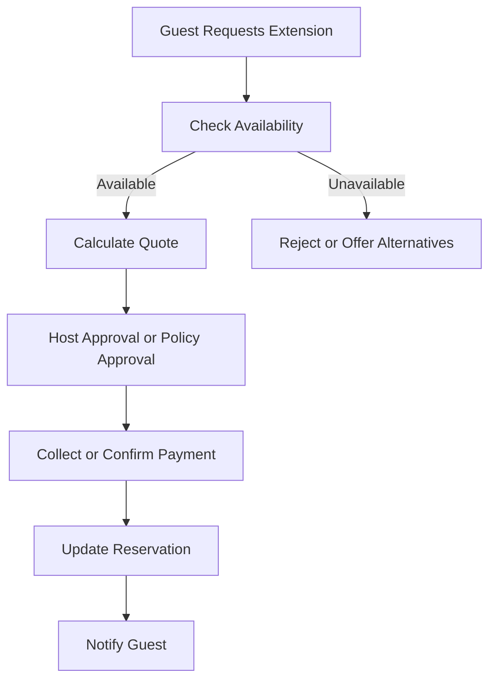

# Extensions

## Business Purpose

Reservation extensions allow guests to request additional nights and help hosts decide whether the property is available, what price applies, and how the stay should be updated.

## User Stories

- As a guest, I want to ask for an extension through WhatsApp.
- As a host, I want to know whether the requested dates are available before approving.
- As an operations user, I want approved extensions to update checkout, pricing, and guest communication.

## Functional Requirements

- Capture extension request date, requested new checkout date, reason, status, quoted price, approval source, and notes.
- Check property availability before approval.
- Update reservation dates and pricing after approval.
- Link extension decisions to guest messages and payment workflows.
- Support rejected, expired, cancelled, and approved extension requests.

## Non-Functional Requirements

- Extension availability checks must avoid double booking.
- Extension state must be auditable.
- Pricing and payment changes must be clear to host and guest.
- AI should not approve extensions without configured authority.

## Validation Rules

- Requested checkout date must be later than current checkout date.
- Extension approval requires availability confirmation.
- Pricing changes should be recorded before guest confirmation.
- Rejected extensions should preserve reason and timestamp.

## Edge Cases

- Another reservation starts immediately after current checkout.
- Guest requests extension after checkout time.
- Host approves manually outside StayFlow.
- Guest accepts price but payment fails.
- Extension request conflicts with cleaning or maintenance block.

## Acceptance Criteria

- Extension documentation covers request, availability, approval, pricing, and payment impact.
- AI authority boundaries are clear.
- Edge cases address availability, late requests, and failed payment.

## Future Enhancements

- Automated extension quote generation.
- Calendar integration for real-time availability.
- Host approval workflow in dashboard.
- Extension upsell recommendations.

