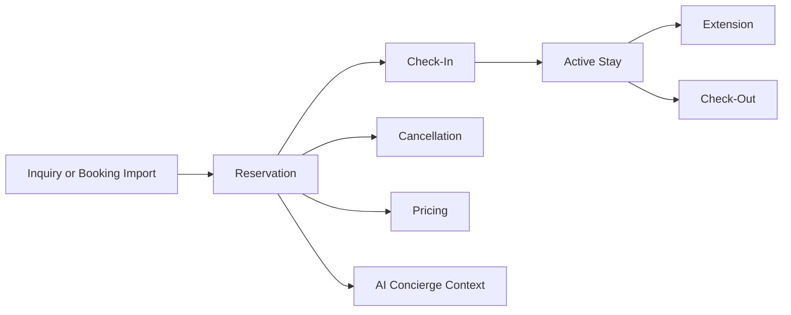

# Reservation Product Documentation

This folder defines the Reservation domain for StayFlow AI. It explains how bookings, check-in, checkout, cancellations, extensions, and reservation pricing support WhatsApp concierge workflows for Airbnb hosts and property managers in Kenya.

## Documents

- [Reservation Overview](ReservationOverview.md)
- [Reservation Lifecycle](ReservationLifecycle.md)
- [Check-In](CheckIn.md)
- [Check-Out](CheckOut.md)
- [Cancellation](Cancellation.md)
- [Extensions](Extensions.md)
- [Pricing](Pricing.md)
- [Acceptance Criteria](AcceptanceCriteria.md)

## Product Scope

The Reservation domain coordinates booking dates, guest stay context, operational readiness, pricing expectations, and lifecycle events that influence the AI concierge experience.

## Business Outcomes

- Help hosts prepare for upcoming stays.
- Give guests accurate arrival, departure, pricing, and policy information.
- Provide AI context for stay-specific support.
- Reduce manual coordination around changes, extensions, and cancellations.
