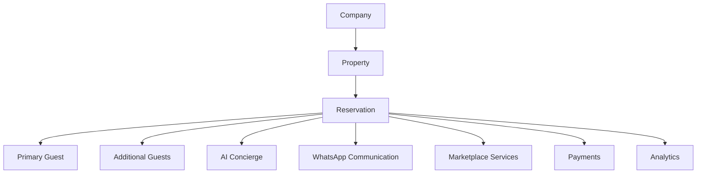

# Reservation Product Documentation

## Executive Summary

The Reservation domain represents a guest stay at a StayFlow-managed property. It is the operational bridge between [Property](../property/README.md), [Guest](../guest/README.md), AI concierge workflows, WhatsApp communication, marketplace services, payments, and analytics.

## Business Purpose

Reservations give StayFlow AI the time-bound stay context needed to support pre-arrival, check-in, active stay, checkout, cancellation, and post-stay workflows. They connect company, property, primary guest, additional guests, source information, lifecycle state, and operational notes without assuming direct access to Airbnb or other booking platform APIs.

## Scope

In scope: reservation profile, source, lifecycle, pre-arrival, check-in, active stay, checkout, cancellation, extensions, reservation guests, privacy, AI context, duplicate detection, tenant validation, and acceptance criteria.

Out of scope: implementing APIs, database migrations, direct booking engine checkout, payment provider integration, and third-party refund policy decisions.

## Actors

- Guest.
- Primary guest.
- Additional guest.
- Host.
- Property manager.
- Company administrator.
- AI concierge.
- WhatsApp integration.
- Marketplace provider.
- Payment workflow.

## Document Index

- [Reservation Overview](ReservationOverview.md)
- [Reservation Lifecycle](ReservationLifecycle.md)
- [Reservation Profile](ReservationProfile.md)
- [Reservation Source](ReservationSource.md)
- [Pre-Arrival](PreArrival.md)
- [Check-In](CheckIn.md)
- [Active Stay](ActiveStay.md)
- [Check-Out](CheckOut.md)
- [Cancellation](Cancellation.md)
- [Reservation Extensions](ReservationExtensions.md)
- [Reservation Guests](ReservationGuests.md)
- [Reservation Privacy](ReservationPrivacy.md)
- [Reservation AI Context](ReservationAIContext.md)
- [Acceptance Criteria](AcceptanceCriteria.md)

## User Stories

- As a host, I want each reservation connected to the correct company, property, and primary guest.
- As a guest, I want support based on my current stay phase.
- As a property manager, I want lifecycle transitions controlled by documented rules.
- As an AI workflow, I need reservation context that is current, minimized, and tenant-safe.

## Functional Requirements

- Connect Company, Property, Reservation, Primary Guest, and Additional Guests.
- Store structured reservation data including source-aware external references, check-in and checkout details, guest counts, status, booking amount when available, requests, and notes.
- Support manual entry and controlled import for MVP.
- Support duplicate detection and review.
- Provide operational context to WhatsApp, AI, marketplace, payment, and analytics workflows.

## Non-Functional Requirements

- Reservation data must be company isolated.
- Lifecycle transitions must be auditable and deterministic.
- Common queries should be index-ready by Company, Property, Primary Guest, dates, source, and status.
- AI context must follow data minimization principles from [Guest AI Context](../guest/GuestAIContext.md) and [AI Context Builder](../ai/ContextBuilder.md).

## Business Rules

- Company, Property, and Primary Guest tenant ownership must match.
- Cross-tenant associations must be rejected.
- External reservation references are source-aware and not globally unique.
- Financial data is optional when the source does not provide it.
- AI must not confirm extensions, late checkout, refunds, or access exceptions unless reservation business rules confirm approval.

## Validation Rules

- Reservation requires Company ID, Property ID, Primary Guest ID, check-in date/time, check-out date/time, reservation source, and status.
- Check-out must be after check-in.
- Total guest count must equal adult plus child counts when both are provided.
- Booking currency is required only when booking amount is provided.
- External reference uniqueness must include Company, source, and external reference at minimum.

## Error Handling

- Cross-company property or guest associations must be rejected.
- Duplicate reservations must be flagged for review unless deterministic source identifiers establish duplication.
- Invalid lifecycle transitions must be rejected with a clear reason.
- Missing source financial data must not block reservation creation.

## Security Considerations

Reservations expose occupancy, guest, access, and operational details. Access must be authorized, company-scoped, and auditable, aligning with [Multi-Tenancy](../../architecture/03-multi-tenancy.md) and [ADR-0006](../../decisions/ADR-0006-use-multi-tenant-saas-design.md).

## Privacy Considerations

Reservation records should minimize additional guest information, avoid unnecessary financial detail in AI context, and exclude internal notes from guest-facing workflows unless explicitly approved.

## Multi-Tenant Considerations

Reservations are company-scoped. A Company A user must never access Company B reservations, properties, guests, conversations, or marketplace requests.

## AI Considerations

Reservation AI context may include reservation status, property, check-in and checkout dates, current stay phase, approved special requests, preferred language, approved guest preferences, and relevant service requests. It must not include internal notes, unrelated financial information, audit logs, other guest information, or sensitive identifiers unless an approved workflow requires the minimum field.

## Edge Cases

- One phone number maps to multiple active reservations.
- Same external confirmation number appears from different sources.
- Imported reservation lacks booking amount.
- Guest is identified after reservation import.
- Property or guest belongs to a different company.

## Future Enhancements

- PMS integration ADR and implementation.
- Reservation conflict calendar.
- Automated source import reconciliation.
- Reservation event stream for analytics.

## Acceptance Criteria

The Reservation documentation is complete when every linked document defines the required sections, lifecycle states align with [Guest Lifecycle](../guest/GuestLifecycle.md), AI context aligns with [Guest AI Context](../guest/GuestAIContext.md), and multi-tenant behavior aligns with [ADR-0006](../../decisions/ADR-0006-use-multi-tenant-saas-design.md).

## Documentation Issues Identified

- Existing [Functional Requirements](../FunctionalRequirements.md) lists Guest and Conversation Management but does not define Reservation as a first-class product domain. This documentation treats Reservation as first-class because the Guest domain now depends on reservation-based property association.
- Existing older reservation files included `Extensions.md` and `Pricing.md`. This task introduces [Reservation Extensions](ReservationExtensions.md) and does not request a standalone pricing document. `Pricing.md` remains historical product documentation and should be reviewed in a future documentation cleanup.
- No ADR currently defines the source integration strategy for Airbnb, Booking.com, Expedia, PMS imports, or manual import precedence. Recommended ADR: `ADR-0007-reservation-source-integration-strategy`.
- No ADR currently defines whether reservation lifecycle transitions should be event-sourced or status-field based. Recommended ADR: `ADR-0008-reservation-lifecycle-state-management`.

