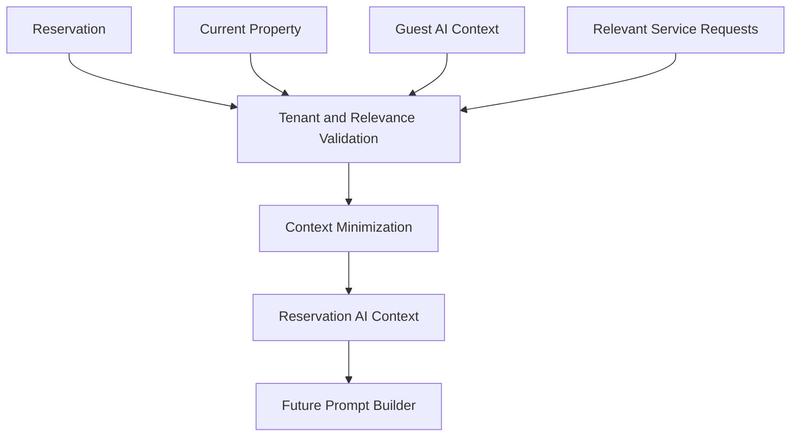

# Reservation AI Context

## Executive Summary

Reservation AI Context defines how reservation data participates in AI context construction alongside [Guest AI Context](../guest/GuestAIContext.md), approved property knowledge, and the future AI Context Builder.

## Business Purpose

Reservation context helps AI answer stay-specific questions accurately while protecting guest privacy, property security, and tenant boundaries.

## Scope

In scope: reservation status, property, check-in date, check-out date, current stay phase, approved special requests, preferred language, approved guest preferences, relevant service requests, exclusions, and minimization rules.

Out of scope: prompt templates and provider-specific model calls.

## Actors

- AI concierge.
- Context builder.
- Prompt builder.
- Guest.
- Host.
- Security reviewer.

## User Stories

- As a guest, I want AI responses to match my reservation phase.
- As a host, I want AI grounded in the current property and approved reservation facts.
- As a security reviewer, I want internal notes and unrelated financial data excluded.

## Functional Requirements

- Build reservation context from company-scoped reservation, property, primary guest, approved property knowledge, current stay phase, approved special requests, and relevant service requests.
- Combine with Guest AI Context only after tenant, guest, and reservation match validation.
- Exclude internal staff notes, unrelated financial information, audit logs, other guest information, and sensitive identifiers by default.
- Handle ambiguous active reservations by clarification or escalation.

## Non-Functional Requirements

- Context construction must be fast for WhatsApp.
- Context must be deterministic and auditable.
- Data minimization must reduce prompt size and privacy exposure.

## Business Rules

- Current reservation is the primary stay context.
- Property knowledge must be approved.
- AI must not confirm extensions, late checkout, refunds, or access exceptions without approved workflow data.
- AI must not assume a phone number maps to one active reservation.

## Validation Rules

- Company scope is required.
- Reservation, property, and primary guest Company IDs must match.
- Reservation must be relevant to the conversation.
- Sensitive fields must be excluded unless approved workflow requires them.

## Error Handling

- Multiple matching reservations require clarification or escalation.
- Missing reservation context blocks stay-specific answers.
- Context validation failure prevents automatic sending.

## Security Considerations

Reservation AI context must not leak access details or cross-tenant data.

## Privacy Considerations

Apply privacy-by-design and context minimization. Avoid sending internal notes, unrelated financial data, full history, or other guest information.

## Multi-Tenant Considerations

Prompt context must contain only data from the reservation company.

## AI Considerations

ReservationAIContext should feed the future Context Builder documented in [Context Builder](../ai/ContextBuilder.md). It complements GuestAIContext rather than replacing it.

## Edge Cases

- Phone number maps to multiple active reservations.
- Guest asks about a cancelled reservation.
- Special request is pending approval.
- Service request contains sensitive details.

## Future Enhancements

- Context trace viewer.
- AI context regression tests.
- Reservation context scoring.

## Acceptance Criteria

- Allowed and excluded reservation context sources are documented.
- Interaction with GuestAIContext and AI Context Builder is defined.
- Ambiguous active reservations fail safely.

