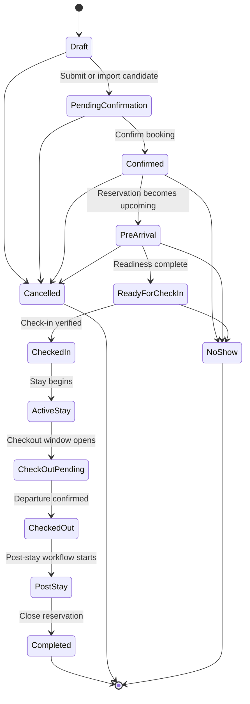

# Reservation Lifecycle

## Executive Summary

The Reservation lifecycle defines valid state transitions from Draft through Completed, with Cancelled and No Show as terminal alternatives.

## Business Purpose

Controlled lifecycle rules prevent arbitrary status changes, improve automation safety, and keep Guest lifecycle, AI context, WhatsApp messaging, and operations aligned.

## Scope

In scope: states, valid transitions, invalid transitions, terminal states, audit expectations, and relationship to [Guest Lifecycle](../guest/GuestLifecycle.md).

Out of scope: implementation-specific state machine code.

## Actors

- Host.
- Property manager.
- Company administrator.
- Reservation import workflow.
- AI concierge.
- Guest support agent.

## User Stories

- As a property manager, I want reservation status changes to follow defined rules.
- As a host, I want cancelled and no-show reservations removed from active stay automation.
- As an AI workflow, I need stay phase to choose safe context.

## Functional Requirements

- Support states: Draft, Pending Confirmation, Confirmed, Pre-Arrival, Ready for Check-In, Checked In, Active Stay, Check-Out Pending, Checked Out, Post-Stay, Completed, Cancelled, No Show.
- Record status change timestamp, actor, source, and reason where applicable.
- Reject invalid transitions.
- Support idempotent external source updates.

## Non-Functional Requirements

- Transitions must be deterministic and auditable.
- Lifecycle state must be company-scoped.
- Workflow automation must be resilient to out-of-order imports.

## Business Rules

- Draft can move to Pending Confirmation or Cancelled.
- Pending Confirmation can move to Confirmed or Cancelled.
- Confirmed can move to Pre-Arrival, Cancelled, or No Show.
- Active Stay can move to Check-Out Pending, Cancelled only with manual exception, or extension review.
- Completed, Cancelled, and No Show are terminal unless reopened by privileged manual correction.

## Validation Rules

- Checked In requires confirmed reservation and eligible guest context.
- Active Stay requires checked-in or equivalent verified occupancy.
- Checked Out cannot occur before check-in without manual correction.
- No Show cannot apply after successful check-in.

## Error Handling

- Invalid transition returns a clear validation error.
- Duplicate external status events are ignored or recorded idempotently.
- Conflicting source updates create review tasks.

## Security Considerations

Status changes can affect access instructions and guest support. Privileged transitions require authorization and audit metadata.

## Privacy Considerations

Lifecycle state reveals occupancy; expose it only to authorized company users and workflows.

## Multi-Tenant Considerations

Lifecycle updates must validate the reservation Company ID and associated property and guest Company IDs.

## AI Considerations

AI may use lifecycle state as current stay phase. AI must not override lifecycle status or invent approval.

## Edge Cases

- Guest arrives before Ready for Check-In.
- Source sends Cancelled after local check-in.
- No-show discovered after scheduled checkout.
- Manual correction is required after staff error.

## Future Enhancements

- Lifecycle state machine service.
- Reservation event history.
- Automated transition rules by property.
- Lifecycle analytics.

## Acceptance Criteria

- Mermaid lifecycle diagram is present.
- Valid and invalid transition rules are documented.
- Lifecycle terminology aligns with Guest lifecycle states Pre-Arrival, Checked In, Active Stay, Check-Out, and Post-Stay.

