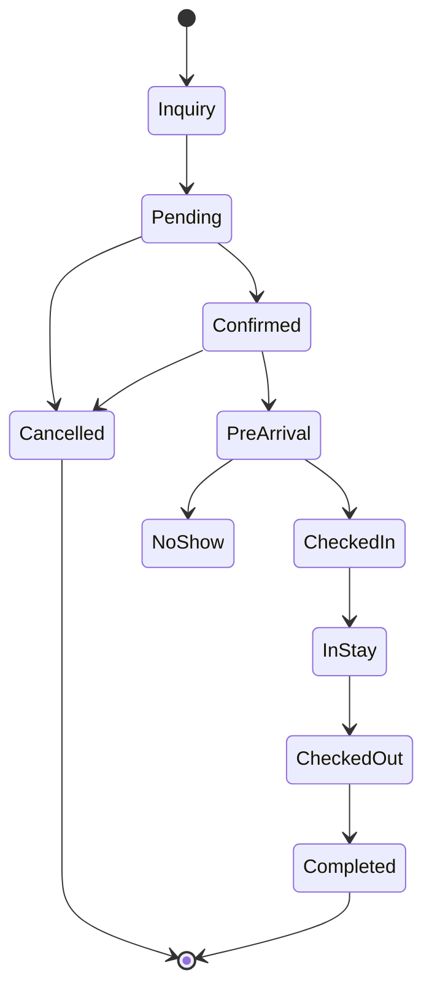

# Reservation Lifecycle

## Business Purpose

The reservation lifecycle defines how a stay moves from inquiry or booking import through confirmation, check-in, active stay, checkout, completion, cancellation, or deletion. It gives StayFlow AI a consistent state model for automation and guest support.

## User Stories

- As a host, I want upcoming reservations to trigger preparation tasks.
- As a guest, I want timely guidance based on where I am in the stay journey.
- As an operations user, I want lifecycle status to show what action is needed next.

## Functional Requirements

- Support lifecycle states for inquiry, pending, confirmed, pre-arrival, checked in, in stay, checked out, completed, cancelled, no-show, and deleted.
- Record lifecycle timestamps and the source of each status change.
- Allow manual updates and future automated updates from booking platforms.
- Trigger concierge context updates when reservation status changes.

## Non-Functional Requirements

- Lifecycle transitions must be auditable and deterministic.
- State changes must be idempotent when received from external systems.
- Lifecycle reads must support dashboards, reminders, and guest messaging.

## Validation Rules

- A reservation cannot move to checked in before it is confirmed unless manually overridden.
- A cancelled reservation should not move to checked in without reopening or reinstating it.
- Completed reservations should be read-only except for notes, payments, and audit adjustments.
- Deletion should be soft delete unless retention policy permits permanent removal.

## Edge Cases

- Booking is cancelled after guest check-in.
- Guest arrives before the expected check-in time.
- External channel sends duplicate or out-of-order status updates.
- No-show is discovered after the planned checkout date.
- Host manually overrides an automated status.

## Acceptance Criteria

- Lifecycle states and transitions are documented clearly.
- Operational and AI workflows can use lifecycle state as reliable context.
- Edge cases cover manual overrides, channel sync, and exceptional stay outcomes.

## Future Enhancements

- Event-driven lifecycle automation.
- Lifecycle-based WhatsApp templates.
- Operational task generation by status.
- SLA tracking for pre-arrival readiness.

