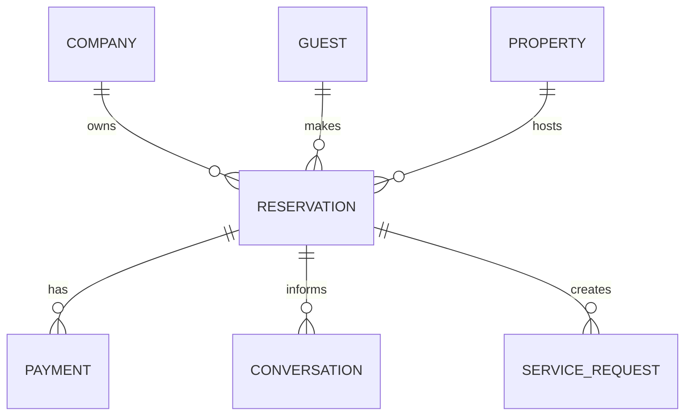

# Reservation Overview

## Business Purpose

The Reservation domain represents a guest's booked or requested stay at a property. It connects guests, properties, dates, pricing, policies, and operational workflows so StayFlow AI can provide accurate, stay-aware concierge support.

## User Stories

- As a host, I want each reservation connected to the correct guest and property so my team can prepare for the stay.
- As a guest, I want the WhatsApp concierge to understand my arrival date, checkout date, and stay details.
- As a property manager, I want reservation status to drive check-in, checkout, cancellation, and extension workflows.
- As an operations user, I want reservation records to provide a reliable source of truth across channels.

## Functional Requirements

- Store reservation reference, company, property, guest, source channel, dates, status, guest count, pricing summary, and notes.
- Support imported bookings, manually created reservations, and future direct bookings.
- Link reservations to conversations, service requests, payments, check-in, checkout, cancellations, and extensions.
- Support search, filtering, pagination, soft deletion, and audit fields in future implementation.
- Expose safe reservation context to AI concierge workflows.

## Non-Functional Requirements

- Reservation data must be company isolated.
- Reservation lookup must be efficient for active-stay WhatsApp interactions.
- Lifecycle changes must be auditable.
- Reservation context must be deterministic when used in AI prompts.

## Validation Rules

- Reservation must belong to one company, one guest, and one property.
- Check-out date must be after check-in date.
- Guest count must be greater than zero.
- Source booking reference should be unique within company and source where available.
- Soft-deleted reservations must not appear in normal operational workflows.

## Edge Cases

- Guest changes dates after confirmation.
- Reservation is imported without complete guest details.
- Reservation is created for multiple units or rooms.
- Booking platform status differs from local StayFlow status.
- A guest has overlapping reservations at different properties.

## Acceptance Criteria

- Reservation documentation defines the domain boundaries and key relationships.
- Reservation context supports guest, property, payment, and AI workflows.
- Validation and edge cases prepare the domain for future API and database design.

## Future Enhancements

- Booking platform synchronization.
- Direct booking checkout.
- Multi-room reservations.
- Reservation conflict detection.

