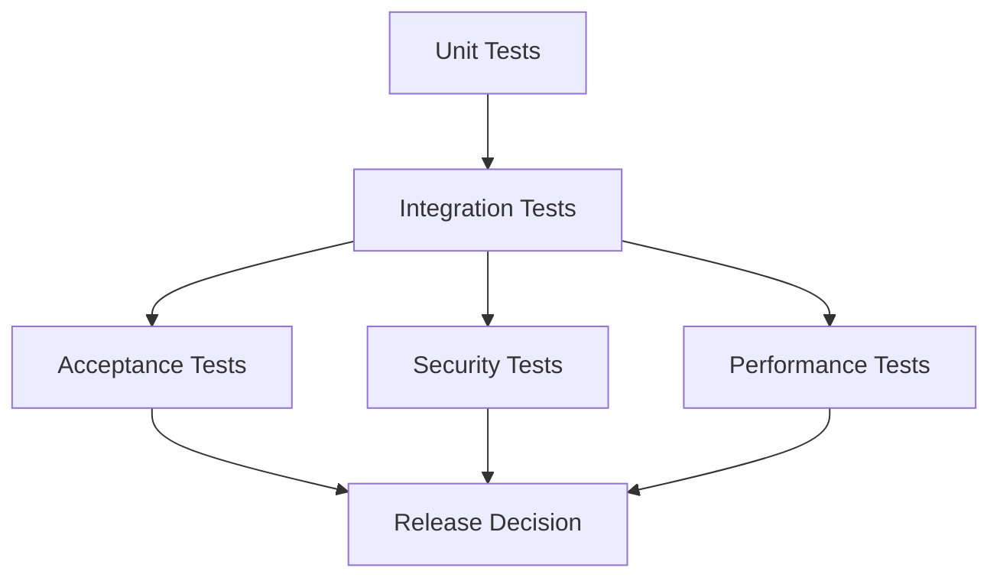

# Testing Strategy

## Purpose

The StayFlow AI testing strategy defines how the team verifies product quality across backend APIs, data access, AI workflows, WhatsApp integrations, billing, marketplace services, and operational dashboards.

## Objectives

- Catch regressions before they reach hosts, property managers, guests, or service providers.
- Protect core SaaS workflows such as authentication, company isolation, property management, guest messaging, reservations, and billing.
- Validate AI behavior with repeatable scenarios rather than ad hoc manual checks.
- Keep tests fast enough for daily development and broad enough for release confidence.

## Test Layers

## Quality Gates

- Pull requests should pass unit tests and relevant integration tests.
- Database changes should include migration validation and relationship checks.
- Security-sensitive changes should include authorization, tenant isolation, and input validation tests.
- AI workflow changes should include fixed prompt/context scenarios and escalation expectations.
- Release candidates should pass acceptance, security, and performance smoke checks.

## Test Data

- Use deterministic fixtures for companies, users, properties, guests, reservations, and marketplace providers.
- Avoid production data in test environments.
- Include multi-tenant fixtures to verify company isolation.
- Include edge-case records such as inactive entities, soft-deleted entities, and missing optional fields.

## Ownership

- Engineers own tests for code they change.
- Product owners define acceptance scenarios for critical workflows.
- Security reviews define abuse, authorization, and privacy test cases.
- QA and operations validate release readiness for end-to-end workflows.

## Acceptance Criteria

- Every major domain has a documented testing approach.
- Critical workflows have automated coverage or explicit manual test plans.
- Test failures are actionable and tied to user-facing risk.
